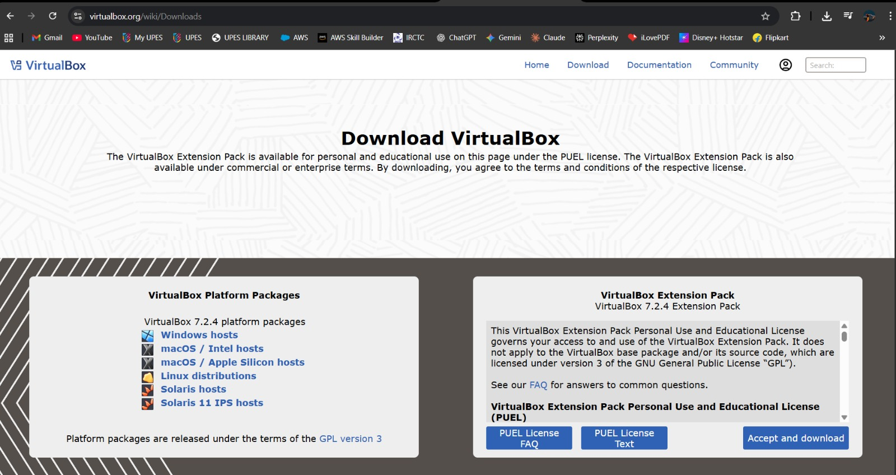

Containerization and DevOps Lab

## EXPERIMENT – 01


Name – Siddharth Negi
Batch - B3
Sap_id - 500121910
Roll_no - R2142231376


## Objective
To understand the conceptual and practical differences between Virtual Machines and Containers.
To install and configure a Virtual Machine using VirtualBox and Vagrant on Windows.
To install and configure Containers using Docker inside WSL.
To deploy an Ubuntu-based Nginx web server in both environments.
To compare resource utilization, performance, and operational characteristics of VMs and Containers.

## Theory
Virtual Machine (VM)
A Virtual Machine emulates a complete physical computer, including its own operating system kernel, hardware drivers, and user space. Each VM runs on top of a hypervisor.
Characteristics:
Full OS per VM
Higher resource usage
Strong isolation
Slower startup time

Container
Containers virtualize at the operating system level. They share the host OS kernel while isolating applications and dependencies in user space.
Characteristics:
Shared kernel
Lightweight
Fast startup
Efficient resource usage


Experiment Setup – Part A: Virtual Machine (Windows)
### Step 1: Install VirtualBox
Download VirtualBox from the official website.
Run the installer and keep default options.
Restart the system if prompted.


### Step 2: Install Vagrant
Download Vagrant for Windows.
Install using default settings.
Verify installation:


```bash
Code : vagrant --version
```


### Step 3: Create Ubuntu VM using Vagrant
Initialize Vagrant with Ubuntu box:
```bash
vagrant init hashicorp/bionic64
```
Start the VM
```bash
vagrant up
```

When you run vagrant init hashicorp/bionic64, Vagrant creates a configuration file called Vagrantfile inside the project folder. This file contains all the instructions needed to create a virtual machine. In hashicorp/bionic64, HashiCorp is the publisher of the Vagrant box, bionic refers to Ubuntu 18.04 LTS (Bionic Beaver), and 64 indicates that it is a 64-bit operating system.
When you run vagrant up, Vagrant reads the Vagrantfile and communicates with VirtualBox (or another configured provider). If the required Ubuntu image is not already available on the system, Vagrant automatically downloads the box. It then creates a virtual machine, allocates system resources such as CPU, RAM, and network settings, and finally boots the Ubuntu virtual machine, making it ready for use.

Access the VM:
```bash
vagrant ssh
```


What’s happening?
Vagrant connects you to the VM using SSH
You enter the Ubuntu terminal without password
You are now inside the virtual machine

### Step 4: Install Nginx inside VM
```bash

```
sudo apt update
sudo apt install -y nginx
sudo systemctl start nginx

```bash
time systemctl start nginx
```
What this command does (combined explanation)
systemctl start nginx
This command tells systemd (Linux service manager) to start the Nginx web server service on the system.
The time keyword measures how long the command takes to execute.
Starts the Nginx service and measures the time taken to start it.
### Step 5: Verify Nginx
```bash
curl localhost
```
Stop and remove vm
```bash

```
vagrant halt
vagrant destroy


Experiment Setup – Part B: Containers using WSL (Windows)
### Step 1: Install WSL 2
```bash
wsl --install
```
Verify installation
```bash
wsl --version
```


### Step 2: Install Ubuntu on WSL
```bash
wsl --install -d Ubuntu
```
Verify installation
```bash
wsl -l -v
```


### Step 3: Install Docker Engine inside WSL
```bash

```
sudo apt update
sudo apt install -y docker.io
sudo systemctl start docker
sudo usermod -aG docker $USER
verify installation


### Step 4: Run Ubuntu Container with Nginx
```bash
docker pull ubuntu
```
docker run -d -p 8080:80 --name nginx-container nginx


Docker pull ubuntu: This command downloads the Ubuntu Linux image from Docker Hub to your system.
Docker run -d -p 8080:80 –name nginx-container nginx: It creates and runs an Nginx container in the background and maps it to port 8080 on your system.

### Step 5: Verify Nginx in Container
```bash
curl localhost:8080
```


Resource Utilization Observation
VM Observation Commands
```bash
free -h
```


What it does:
Displays memory (RAM) usage of the system
What it shows:
Total RAM	Used RAM	Free RAM	Available RAM		Swap memory


```bash
htop
```
What it does:
Shows real-time system performance
What it displays:
CPU usage 	RAM usage	Running processes	Process IDs, users, load average


```bash
systemd-analyze
```


What it does:
Measures system boot time
What it shows:
Time taken by:
Kernel
Userspace
Total boot time

Container Observation Commands
```bash
docker stats
```


What it does:
Shows real-time resource usage of running containers
What you’ll see:
CPU usage	Memory usage / limit		Network I/O		Disk I/O


```bash
free -h
```
What this command does
Displays the system’s memory (RAM) usage
Shows how much memory is:
Total	Used	Free	Available	Swap
The -h flag means human-readable (MB / GB instead of bytes).


Parameters to Compare: Virtual Machine vs Container

Explanation of Each Parameter
Boot Time
Virtual Machine: Takes more time to start because it boots a full operating system.
Container: Starts almost instantly since it shares the host OS kernel.

RAM Usage
Virtual Machine: Requires dedicated memory for its own OS and services.
Container: Uses less memory as it shares system resources with the host.

CPU Overhead
Virtual Machine: More CPU usage due to hardware virtualization.
Container: Minimal overhead because applications run directly on the host kernel.

Disk Usage
Virtual Machine: Needs large disk space for OS image and virtual disks.
Container: Lightweight images consume less storage.

Isolation
Virtual Machine: Strong isolation as each VM runs its own OS.
Container: Moderate isolation since containers share the host OS kernel.

## Conclusion
Virtual Machines are suitable for full OS isolation and legacy workloads, whereas Containers are ideal for microservices, rapid deployment, and efficient resource utilization.
