# Lab Experiment 10
# SonarQube — Static Code Analysis

## Theory

### Problem Statement

Code bugs and security issues are often found too late — during testing or even after deployment. Manual code reviews are slow, inconsistent, and don't scale as teams grow. As software projects increase in size and complexity, the need for automated, consistent, and continuous code quality monitoring becomes critical.

### What is SonarQube?

**SonarQube** is an open-source platform that automatically scans your source code for bugs, security vulnerabilities, and maintainability issues — **without running the code**. This process is known as **Static Code Analysis** (or Static Application Security Testing, SAST).

Unlike dynamic testing (which runs the application), static analysis examines the source code structure, patterns, and logic — catching problems at the earliest possible stage of development.

### How SonarQube Solves the Problem

| Challenge | SonarQube's Solution |
|-----------|----------------------|
| Late bug discovery | Scans on every commit, giving immediate feedback |
| Inconsistent reviews | Applies a uniform, configurable rule set across all code |
| No deployment safety | Enforces Quality Gates — pass/fail checks before code is deployed |
| Growing technical debt | Tracks Technical Debt — estimates fix time for all flagged issues |
| Multi-language teams | Supports 20+ programming languages |
| Lack of visibility | Provides a visual dashboard for trends and history over time |

### Static Analysis vs Dynamic Analysis

| Aspect | Static Analysis (SonarQube) | Dynamic Analysis (Testing) |
|--------|-----------------------------|----------------------------|
| Code execution | Not required | Required |
| Stage | Development / Pre-commit | Testing / Runtime |
| Speed | Very fast | Slower |
| Coverage | All code paths | Only executed paths |
| Security detection | Early | Late |

---

## Key Terminology

| Term | Definition |
|------|------------|
| **Quality Gate** | A set of rules; code must pass before deployment |
| **Bug** | Code that will likely break or behave incorrectly at runtime |
| **Vulnerability** | A security weakness in the code that could be exploited |
| **Code Smell** | Code that works but is poorly written or hard to maintain |
| **Technical Debt** | Estimated time required to fix all identified issues |
| **Coverage** | Percentage of code tested by unit tests |
| **Duplication** | Repeated code blocks (copy-paste code) |

---

## Lab Architecture

SonarQube has two separate components — a **Server** (the brain) and a **Scanner** (the worker). Both are required for the pipeline to function.

```
┌─────────────────────────────────────────────────────────┐
│                   Your Machine / CI                     │
│                                                         │
│  ┌──────────────┐         ┌──────────────────────────┐  │
│  │  Your Code   │─────────▶   Sonar Scanner          │  │
│  │ (Java, JS,   │  scans  │ (CLI / Maven / Jenkins)  │  │
│  │  Python...)  │         └────────────┬─────────────┘  │
│  └──────────────┘                      │ sends report   │
│                                        ▼                │
│                       ┌─────────────────────────┐       │
│                       │   SonarQube Server       │       │
│                       │   (runs on port 9000)    │       │
│                       │  ┌─────────────────┐    │       │
│                       │  │ Analysis Engine  │    │       │
│                       │  │  Quality Gates   │    │       │
│                       │  │  Web Dashboard   │    │       │
│                       │  └────────┬────────┘    │       │
│                       └───────────┼─────────────┘       │
│                                   │ stores results       │
│                       ┌───────────▼─────────────┐       │
│                       │   PostgreSQL Database    │       │
│                       └─────────────────────────┘       │
└─────────────────────────────────────────────────────────┘
```

---

## Components: Server vs Scanner

### Part 1: SonarQube Server — "The Brain"

The SonarQube Server is a web application that:
- Stores all analysis results in a PostgreSQL database
- Applies code quality rules (bugs, vulnerabilities, smells)
- Shows a web dashboard at `http://localhost:9000`
- Enforces Quality Gates (pass/fail decisions)
- Tracks history and trends over time

> **Analogy:** Think of it as a *teacher / examiner* — it receives work, grades it, and shows the report card.

**Internal Components:**

| Component | Role |
|-----------|------|
| Analysis Engine | Applies quality rules to submitted code reports |
| Web UI | Dashboard you browse to at port 9000 |
| PostgreSQL Database | Persists all analysis results and history |

---

### Part 2: Sonar Scanner — "The Worker"

The Sonar Scanner is a command-line tool that:
- Reads your source code files
- Detects issues based on the server's rule set
- Sends an analysis report to the SonarQube Server

> **Analogy:** Think of it as a *student writing an exam* — it does the work and submits it.

**Scanner Types:**

| Scanner Type | When to Use |
|--------------|-------------|
| `sonar-scanner` (CLI) | Any project, run manually |
| Maven plugin (`mvn sonar:sonar`) | Java/Maven projects |
| Gradle plugin | Java/Gradle projects |
| Jenkins integration | CI/CD pipelines |
| GitHub Actions | Automated PRs |

---

### Why Both Are Required

```
Only Server installed          Only Scanner installed
─────────────────────          ──────────────────────
Dashboard is empty             Nowhere to send results
No code gets analyzed          Analysis is wasted

Both installed together
───────────────────────
Full pipeline works ✓
```

**Pipeline Flow:**

```
[ Your Code ]
      │
      ▼
[ Sonar Scanner ] ◀── reads code, detects issues
      │
      │  sends analysis report (HTTP + Token)
      ▼
[ SonarQube Server ] ◀── validates, stores, displays results
      │
      ▼
[ PostgreSQL Database ] ◀── persists everything
```

---

## Token Authentication Flow

The scanner does not use a username/password — it uses a **token** for authentication.

```
┌──────────────────────────────────────────────────────────┐
│                       Token Flow                         │
│                                                          │
│  [SonarQube Web UI]                                      │
│  Admin → My Account → Security → Generate Token          │
│  Token: sqp_xxxxxxxx  ◀── copy this                      │
│                │                                         │
│                │  you paste it into:                     │
│                ▼                                         │
│  [Sonar Scanner]                                         │
│  -Dsonar.login=sqp_xxxxxxxx                              │
│  OR                                                      │
│  export SONAR_TOKEN=sqp_xxxxxxxx                         │
│                │                                         │
│                │  HTTP request with token                │
│                ▼                                         │
│  [SonarQube Server]                                      │
│  Validates token → Accepts analysis → Stores results     │
│                │                                         │
│                ▼                                         │
│  [Dashboard]                                             │
│  http://localhost:9000 → view issues                     │
└──────────────────────────────────────────────────────────┘
```

**Token Rules:**
- Generated once in the Server UI
- Used by the Scanner on every scan
- Shown **only once** — copy it immediately after generation

**Three Ways to Pass the Token:**

```bash
# Option A — directly in the command
sonar-scanner -Dsonar.login=YOUR_TOKEN

# Option B — environment variable (preferred in CI)
export SONAR_TOKEN=YOUR_TOKEN
sonar-scanner -Dsonar.host.url=http://localhost:9000

# Option C — Maven flag
mvn sonar:sonar -Dsonar.login=YOUR_TOKEN
```

---

## Hands-On Lab Procedure

### Step 1: Start the SonarQube Server

Using Docker Compose to start SonarQube and its PostgreSQL database together:

```yaml
# docker-compose.yml
version: '3.8'
services:
  sonar-db:
    image: postgres:13
    container_name: sonar-db
    environment:
      POSTGRES_USER: sonar
      POSTGRES_PASSWORD: sonar
      POSTGRES_DB: sonarqube
      POSTGRES_HOST_AUTH_METHOD: trust
    volumes:
      - sonar-db-data:/var/lib/postgresql/data
    networks:
      - sonarqube-lab

  sonarqube:
    image: sonarqube:lts-community
    container_name: sonarqube
    ports:
      - "9000:9000"
    environment:
      SONAR_JDBC_URL: jdbc:postgresql://sonar-db:5432/sonarqube
      SONAR_JDBC_USERNAME: sonar
      SONAR_JDBC_PASSWORD: sonar
    volumes:
      - sonar-data:/opt/sonarqube/data
      - sonar-extensions:/opt/sonarqube/extensions
    depends_on:
      - sonar-db
    networks:
      - sonarqube-lab

volumes:
  sonar-db-data:
  sonar-data:
  sonar-extensions:

networks:
  sonarqube-lab:
    driver: bridge
```

```bash
docker-compose up -d
docker-compose logs -f sonarqube   # wait for "SonarQube is up"
```

Access: `http://localhost:9000` — Default credentials: `admin / admin`

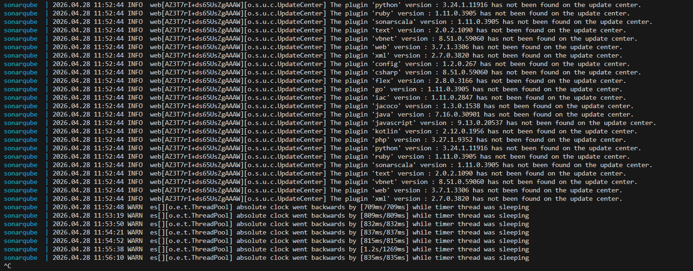
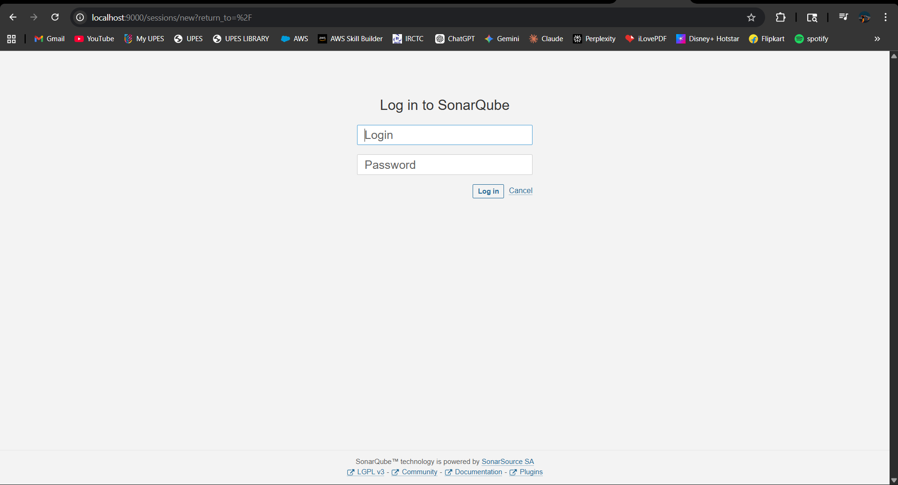
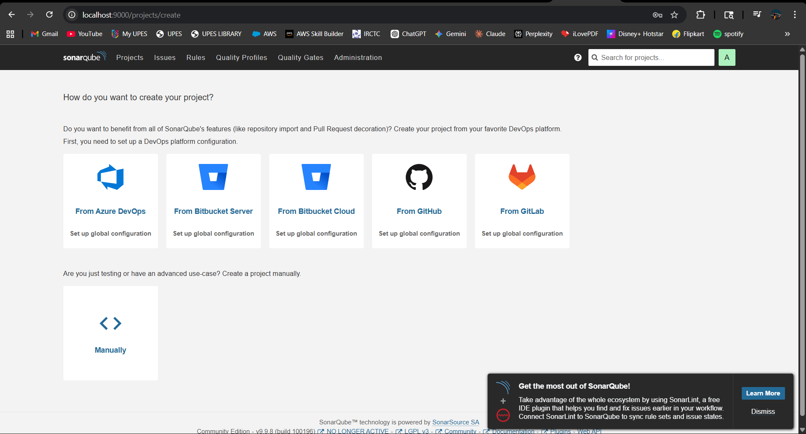
---

### Step 2: Create a Sample Java App with Intentional Code Issues

**File:** `src/main/java/com/example/Calculator.java`

```java
package com.example;

public class Calculator {

    // BUG: Division by zero is not handled
    public int divide(int a, int b) {
        return a / b;
    }

    // CODE SMELL: Unused variable
    public int add(int a, int b) {
        int result = a + b;
        int unused = 100; // flagged by SonarQube
        return result;
    }

    // VULNERABILITY: SQL Injection risk
    public String getUser(String userId) {
        String query = "SELECT * FROM users WHERE id=" + userId;
        return query;
    }

    // CODE SMELL: Duplicated code
    public int multiply(int a, int b) {
        int result = 0;
        for (int i = 0; i < b; i++) { result = result + a; }
        return result;
    }

    public int multiplyAlt(int a, int b) {
        int result = 0;
        for (int i = 0; i < b; i++) { result = result + a; } // exact duplicate
        return result;
    }

    // BUG: Null pointer risk
    public String getName(String name) {
        return name.toUpperCase(); // NullPointerException if name is null
    }

    // CODE SMELL: Empty catch block
    public void riskyOperation() {
        try {
            int x = 10 / 0;
        } catch (Exception e) {
            // never leave catch blocks empty
        }
    }
}
```
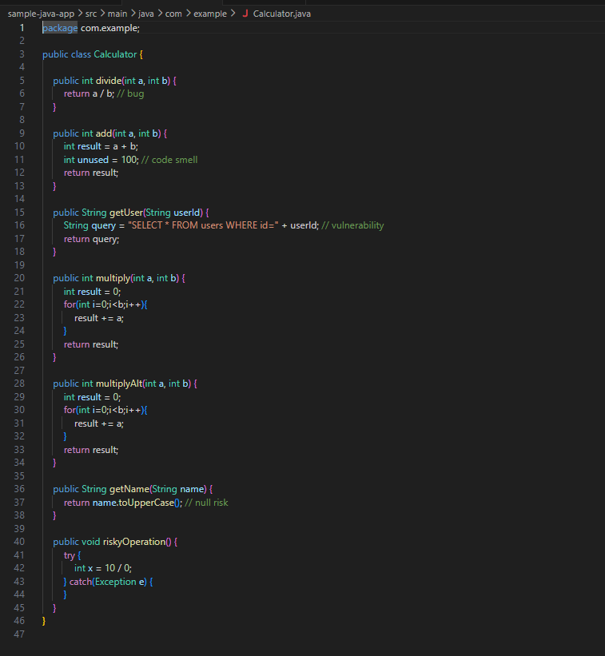

**Summary of Intentional Issues Introduced:**

| Issue Type | Description | Line/Method |
|------------|-------------|-------------|
| Bug | Division by zero not handled | `divide()` |
| Bug | Null pointer risk | `getName()` |
| Vulnerability | SQL Injection via string concatenation | `getUser()` |
| Code Smell | Unused variable | `add()` |
| Code Smell | Duplicated code blocks | `multiply()` / `multiplyAlt()` |
| Code Smell | Empty catch block | `riskyOperation()` |

---

### Step 3: Generate Authentication Token

1. Open `http://localhost:9000`
2. Log in as `admin`
3. Click user icon (top-right) → **My Account**
4. Click the **Security** tab
5. Under "Generate Tokens" → type name: `scanner-token`
6. Click **Generate**
7. Copy the token immediately — it looks like: `sqp_xxxxxxxxxxxxxxxxxxxxxxxxxxxxxxxx`

> ⚠️ The token is shown **only once**. Store it securely.
 
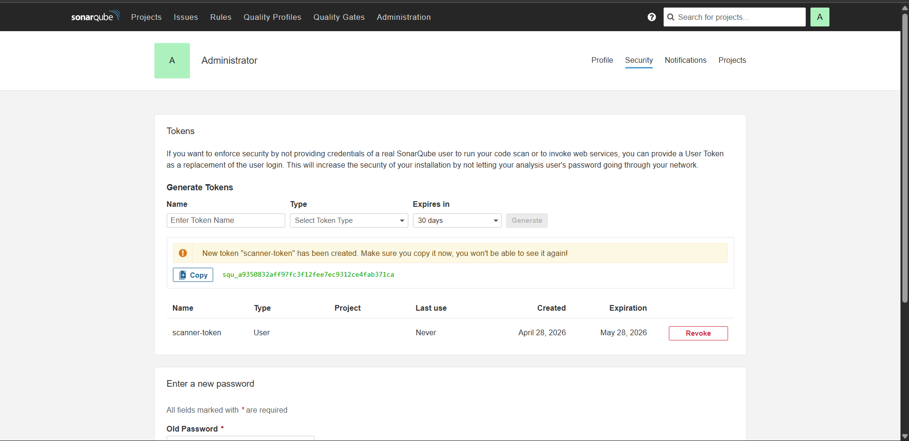

---

### Step 4: Run the Scanner

**Option A — Maven Plugin (recommended for Java):**

```bash
cd sample-java-app
mvn sonar:sonar -Dsonar.login=YOUR_TOKEN
```
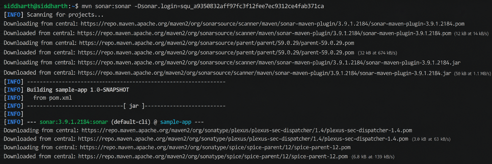

Run via Docker:

```bash
docker run --rm \
  --network sonarqube-lab \
  -e SONAR_TOKEN="YOUR_TOKEN" \
  -v "$(pwd):/usr/src" \
  sonarsource/sonar-scanner-cli \
  -Dsonar.host.url=http://sonarqube:9000 \
  -Dsonar.projectBaseDir=/usr/src \
  -Dsonar.projectKey=sample-java-app
```

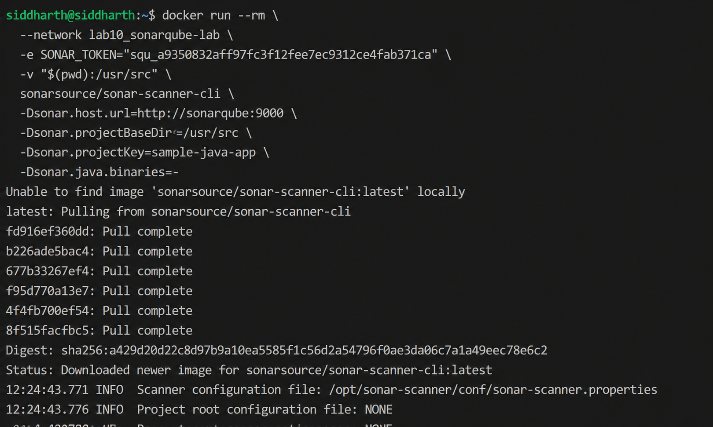

**Docker Flag Reference:**

| Flag | Purpose |
|------|---------|
| `--rm` | Auto-delete container after scan |
| `--network` | Connect to SonarQube Docker network |
| `-e SONAR_TOKEN` | Authentication token |
| `-v` | Mount source code into container |
| `-Dsonar.host.url` | Server URL (use container name, not localhost) |
| `-Dsonar.projectBaseDir` | Project root inside container |
| `-Dsonar.projectKey` | Project identifier on the server |

---

### Step 5: View Results in the Dashboard

Access: `http://localhost:9000/dashboard?id=sample-java-app`

**Expected Dashboard Output:**

```
┌─────────────────────────────────────────────┐
│     sample-java-app — Dashboard             │
├──────────────┬──────────────┬───────────────┤
│    Bugs      │  Vulnerab.   │  Code Smells  │
│      5       │      1       │       8       │
├──────────────┴──────────────┴───────────────┤
│ Coverage: 0%       Duplications: 2 blocks   │
│ Technical Debt: ~1h 30min                   │
│ Quality Gate: ✗ FAILED                      │
└─────────────────────────────────────────────┘
```

You can also query results via the REST API:

```bash
curl -u admin:YOUR_TOKEN \
  "http://localhost:9000/api/issues/search?projectKeys=sample-java-app&types=BUG"
```
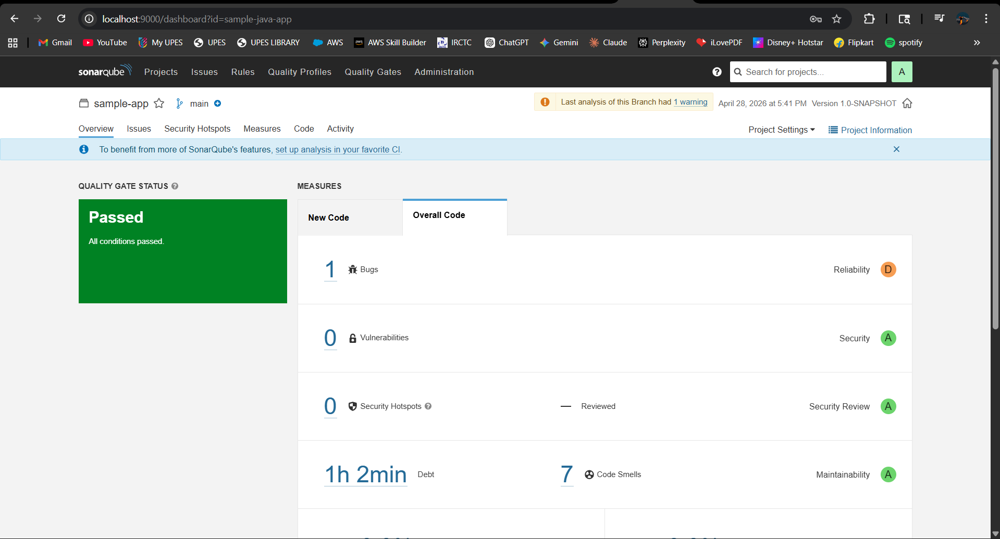
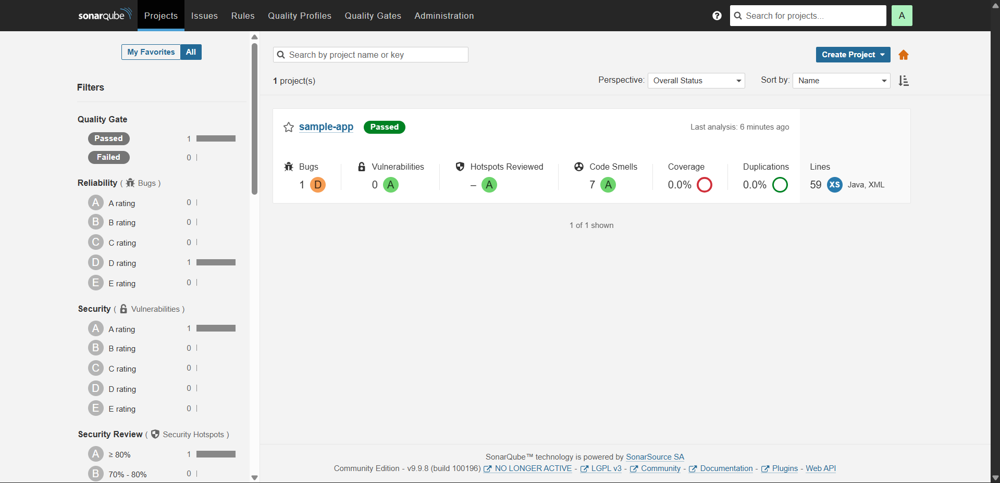
---

### Maven Scanner Execution — Key Events

The scanner log (starting around line 884 in text.txt) shows the complete Maven scan run:

| Phase | Detail |
|-------|--------|
| Project loading | `sample-app` loaded, analysis cache hit (116 bytes) |
| Files indexed | **2 files** indexed |
| Quality profiles applied | Java: `Sonar way`, XML: `Sonar way` |
| Java sensor | Analyzed **1 Main Java source file** (Calculator.java) using ECJ batch — 100% analyzed |
| JaCoCo | No coverage report found (expected — no tests written) → Coverage = **0%** |
| CSS/HTML/VueJS | No such files found — skipped |
| XML sensor | 1 source file analyzed (`pom.xml`) |
| Text/Secrets sensor | 2 source files analyzed |
| CPD (Copy-Paste Detection) | Calculated for 1 file |

**Final Build Outcome:**

```
[INFO] ANALYSIS SUCCESSFUL
[INFO] Results at: http://localhost:9000/dashboard?id=sample-java-app
[INFO] BUILD SUCCESS
[INFO] Total time:  9.790 s
[INFO] Finished at: 2026-04-28T18:11:26+05:30
```

The analysis completed in **9.79 seconds** total (6.1s for analysis itself), and the report was successfully uploaded to the SonarQube server.

---

## Jenkins CI/CD Integration

Once SonarQube is working locally, it can be integrated into a Jenkins pipeline so every commit is automatically scanned.

```groovy
// Jenkinsfile
pipeline {
    agent any
    environment {
        SONAR_HOST_URL = 'http://sonarqube:9000'
        SONAR_TOKEN = credentials('sonar-token')
    }
    stages {
        stage('Checkout') {
            steps { checkout scm }
        }
        stage('SonarQube Analysis') {
            steps {
                withSonarQubeEnv('SonarQube') {
                    sh 'mvn clean verify sonar:sonar'
                }
            }
        }
        stage('Quality Gate') {
            steps {
                timeout(time: 5, unit: 'MINUTES') {
                    waitForQualityGate abortPipeline: true
                }
            }
        }
        stage('Build') {
            steps { sh 'mvn package' }
        }
        stage('Deploy') {
            steps {
                sh 'docker build -t sample-app .'
                sh 'docker run -d -p 8080:8080 sample-app'
            }
        }
    }
}
```

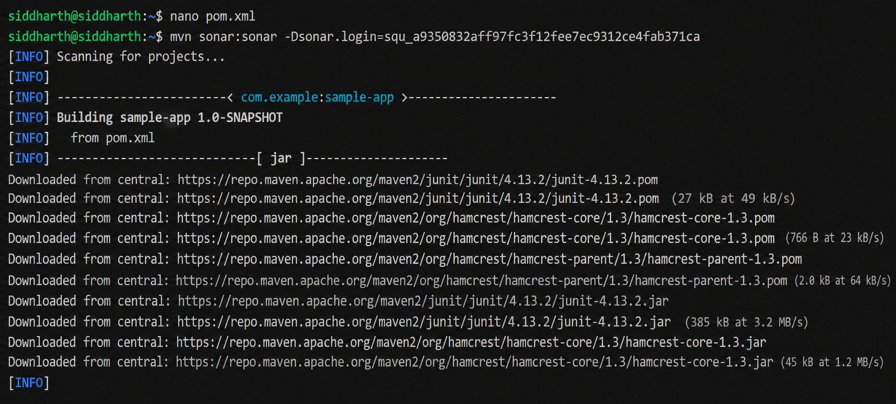
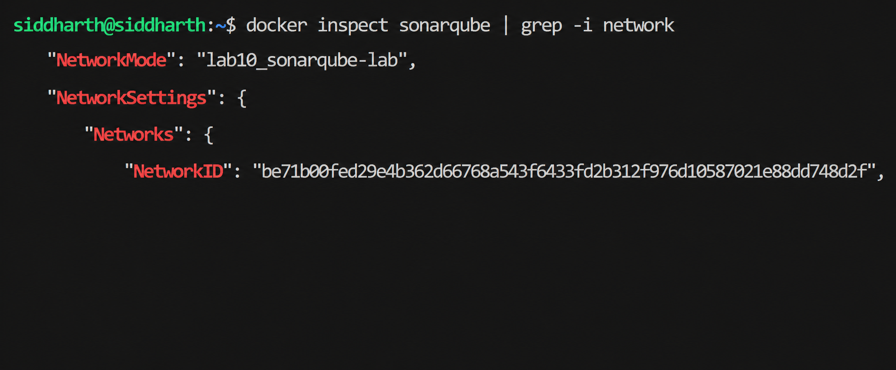

**Pipeline Flow:**

```
Checkout → SonarQube Scan → Quality Gate Check → Build → Deploy
                                    │
                                  FAIL?
                                    │
                            Pipeline stops.
                       Code does not get deployed.
```

---

## Comparative Analysis

### DevOps Tool Comparison Matrix

| Feature | Jenkins | Ansible | Chef | SonarQube |
|---------|---------|---------|------|-----------|
| Primary Purpose | CI/CD Automation | Config Management | Config Management | Code Quality |
| Architecture | Master-Agent | Agentless | Client-Server | Client-Server |
| Language | Java / Groovy | YAML | Ruby | Java |
| Learning Curve | Moderate | Low | High | Low |
| Setup Complexity | Moderate | Simple | Complex | Simple |
| Use Case | Build, Test, Deploy | Infrastructure as Code | Enterprise CM | Static Analysis |

### Key Differences

**Jenkins vs. Configuration Management:** Use Jenkins to orchestrate pipelines (build → test → deploy). Use Ansible or Chef to maintain server configuration. In practice, Jenkins calls Ansible/Chef as part of the deployment step.

**Ansible vs. Chef:**

| Aspect | Ansible | Chef |
|--------|---------|------|
| Complexity | Simple, YAML | Complex, Ruby |
| Agent required | No (agentless) | Yes (chef-client) |
| Best for | Small–medium teams | Large enterprise |

**SonarQube in CI/CD:** Scan on every pull request and every nightly build. Use Quality Gates to block deployments when code quality drops below the configured threshold.

---


## Summary

| Concept | Description |
|---------|-------------|
| **SonarQube** | The analysis platform that stores and displays results |
| **Sonar Scanner** | The tool that reads your code and sends the report |
| **Both Required** | Scanner without Server = nowhere to send; Server without Scanner = nothing to analyze |
| **Token** | Secure authentication key generated once in the Web UI; used by Scanner on every run |
| **Quality Gate** | Pass/fail threshold that blocks bad code from deployment |
| **Technical Debt** | Quantified estimate of the effort needed to fix all flagged issues |
---