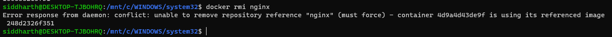

# UNIVERSITY OF PETROLEUM AND ENERGY STUDIES (UPES)

## Containerization and DevOps  
### Lab File  

**Submitted to:**  
Mr. Prateek Raj Gautam  

**Submitted by:**  
Siddharth Negi  
R2142231376  
SAP ID: 500121910  

---

# Experiment – 2  
## Docker Installation, Configuration, and Running Images  

---

## Objective

- Pull Docker images  
- Run containers  
- Manage container lifecycle  

---

## Procedure

### Step 1: Pull Image

```bash
docker pull nginx
```

### Step 2: Run Container with Port Mapping

```bash
docker run -d -p 8080:80 nginx
```

### Step 3: Verify Running Containers

```bash
docker ps
```


### Step 4: Stop and Remove Container

```bash
docker stop <container_id>
docker rm <container_id>
```

### Step 5: Remove Image

```bash
docker rmi -f nginx
```

---

## Result

Docker images were successfully pulled, containers executed, and lifecycle commands performed.

---

## Overall Conclusion

This lab demonstrated virtualization using **Vagrant + VirtualBox** and containerization using **Docker**, highlighting performance and resource efficiency differences. Containers are better suited for rapid deployment and microservices, while VMs provide stronger isolation.
