# **Experiment 4: Docker Essentials**
## `Dockerfile` `.dockerignore` `tagging` `publishing` 

## **Part 1: Containerizing Applications with Dockerfile**

### **Step 1: Create a Simple Application**

**Python Flask App:**
```bash
mkdir my-flask-app
cd my-flask-app
```
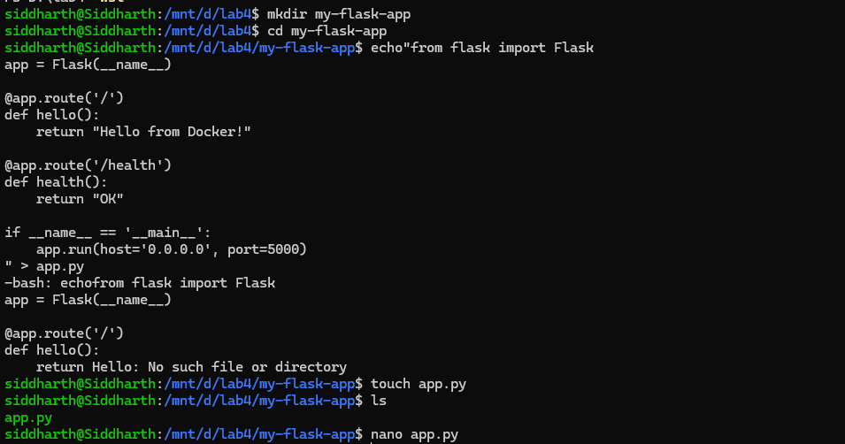

**`app.py`:**
```python
from flask import Flask
app = Flask(__name__)

@app.route('/')
def hello():
    return "Hello from Docker!"

@app.route('/health')
def health():
    return "OK"

if __name__ == '__main__':
    app.run(host='0.0.0.0', port=5000)
```
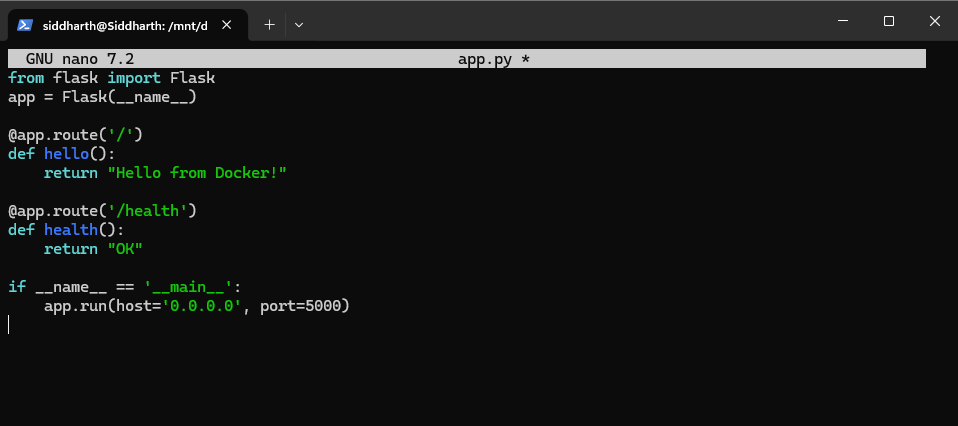

**`requirements.txt`:**
```
Flask==2.3.3
```


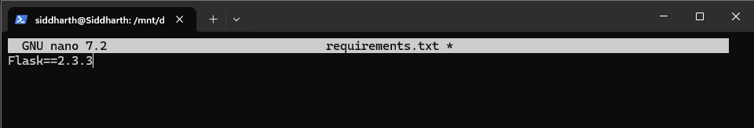

### **Step 2: Create Dockerfile**

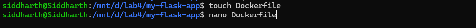

**`Dockerfile`:**
```dockerfile
# Use Python base image
FROM python:3.9-slim

# Set working directory
WORKDIR /app

# Copy requirements file
COPY requirements.txt .

# Install dependencies
RUN pip install --no-cache-dir -r requirements.txt

# Copy application code
COPY app.py .

# Expose port
EXPOSE 5000

# Run the application
CMD ["python", "app.py"]
```
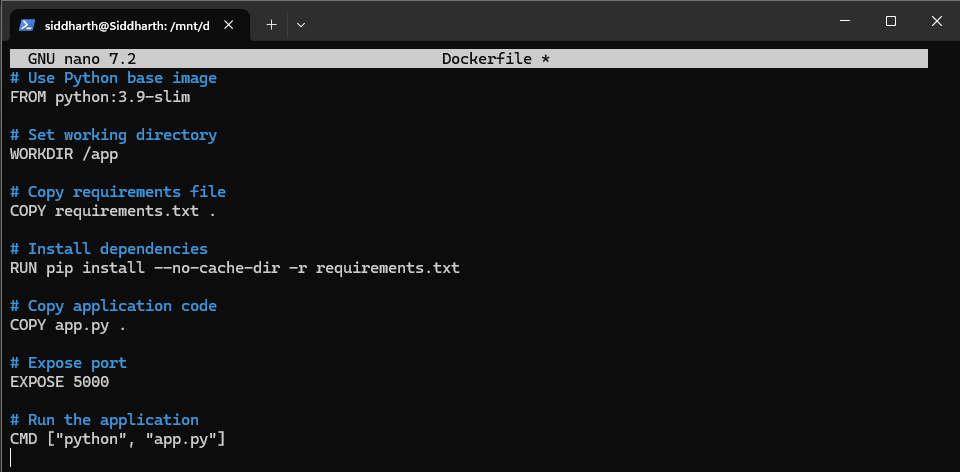

---

## **Part 2: Using .dockerignore**

### **Step 1: Create .dockerignore File**

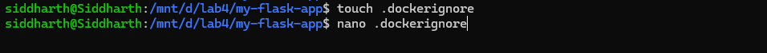

**`.dockerignore`:**
```
# Python files
__pycache__/
*.pyc
*.pyo
*.pyd

# Environment files
.env
.venv
env/
venv/

# IDE files
.vscode/
.idea/

# Git files
.git/
.gitignore

# OS files
.DS_Store
Thumbs.db

# Logs
*.log
logs/

# Test files
tests/
test_*.py
```
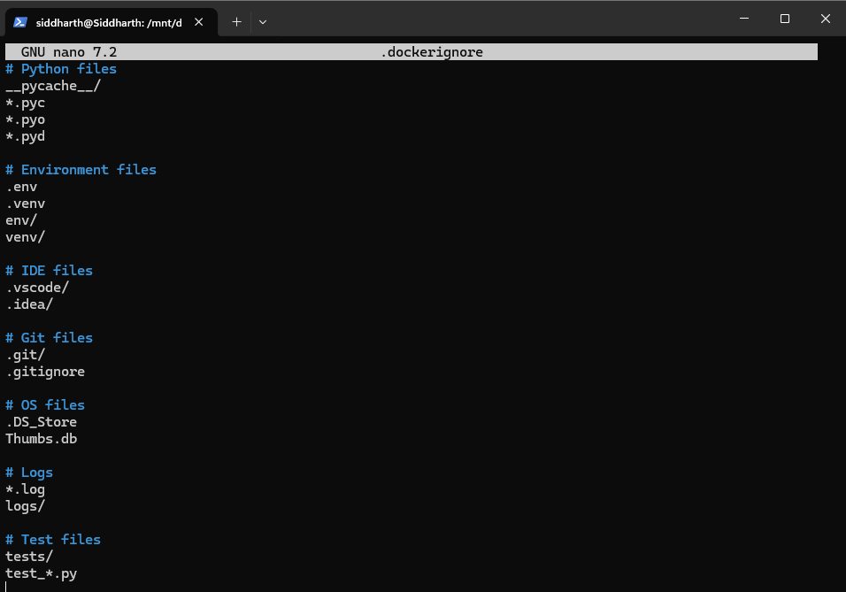

### **Step 2: Why .dockerignore is Important**
- Prevents unnecessary files from being copied
- Reduces image size
- Improves build speed
- Increases security

---

## **Part 3: Building Docker Images**

### **Step 1: Basic Build Command**
```bash
# Build image from Dockerfile
docker build -t my-flask-app .
```
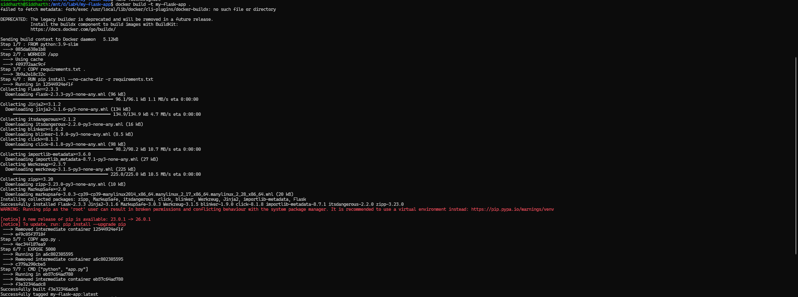
```bash
# Check built images
docker images
```
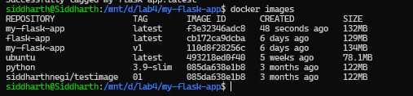

### **Step 2: Tagging Images**

```bash
# Tag with version number
docker build -t my-flask-app:1.0 .
```
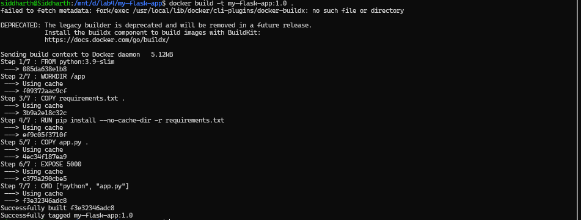

```bash
# Tag with multiple tags
docker build -t my-flask-app:latest -t my-flask-app:1.0 .
```


```bash
# Tag with custom registry
docker build -t username/my-flask-app:1.0 .
```
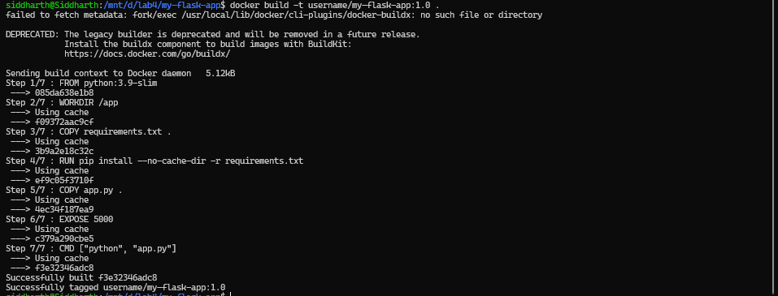

```bash
# Tag existing image
docker tag my-flask-app:latest my-flask-app:v1.0
```

### **Step 3: View Image Details**
```bash
# List all images
docker images

# Show image history
docker history my-flask-app

# Inspect image details
docker inspect my-flask-app
```
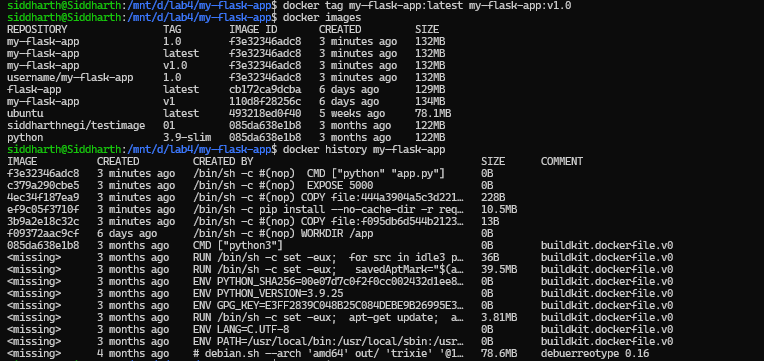

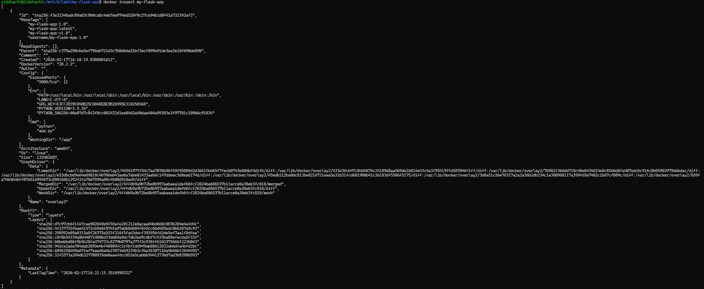
---

## **Part 4: Running Containers**

### **Step 1: Run Container**
```bash
# Run container with port mapping
docker run -d -p 5000:5000 --name flask-container my-flask-app

# Test the application
curl http://localhost:5000

# View running containers
docker ps

# View container logs
docker logs flask-container
```
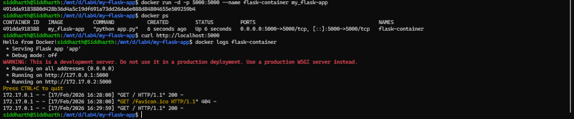

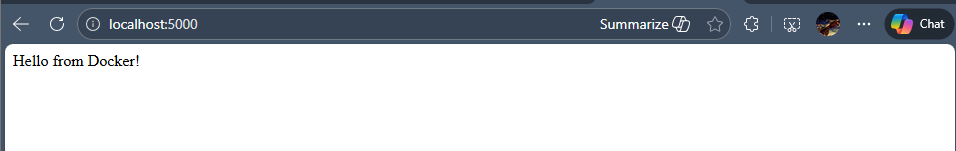

### **Step 2: Manage Containers**
```bash
# Stop container
docker stop flask-container

# Start stopped container
docker start flask-container

# Remove container
docker rm flask-container

# Remove container forcefully
docker rm -f flask-container
```
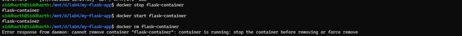

### Explanation
```bash
docker rm flask-container
```
The docker rm command is used to remove (delete) a container. However, Docker does not allow removal of a container that is currently in the running state. A container must first be stopped before it can be removed.

This design ensures:

- Running processes are not abruptly terminated
- Active services are not accidentally deleted
- Data integrity is maintained


The container is permanently deleted from Docker.
If we attempt to remove it again using:
```bash
docker rm -f flask-container
```
Docker returns:

```bash
Error response from daemon: No such container: flask-container
```

This happens because the container has already been removed and no longer exists in the Docker engine.
Hence, this is not an actual error but expected behavior.

---

## **Part 5: Multi-stage Builds**

### **Step 1: Why Multi-stage Builds?**
- Smaller final image size
- Better security (remove build tools)
- Separate build and runtime environments

### **Step 2: Simple Multi-stage Dockerfile**

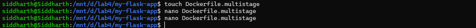

**`Dockerfile.multistage`:**
```dockerfile
# STAGE 1: Builder stage
FROM python:3.9-slim AS builder

WORKDIR /app

# Copy requirements
COPY requirements.txt .

# Install dependencies in virtual environment
RUN python -m venv /opt/venv
ENV PATH="/opt/venv/bin:$PATH"
RUN pip install --no-cache-dir -r requirements.txt

# STAGE 2: Runtime stage
FROM python:3.9-slim

WORKDIR /app

# Copy virtual environment from builder
COPY --from=builder /opt/venv /opt/venv
ENV PATH="/opt/venv/bin:$PATH"

# Copy application code
COPY app.py .

# Create non-root user
RUN useradd -m -u 1000 appuser
USER appuser

# Expose port
EXPOSE 5000

# Run application
CMD ["python", "app.py"]
```
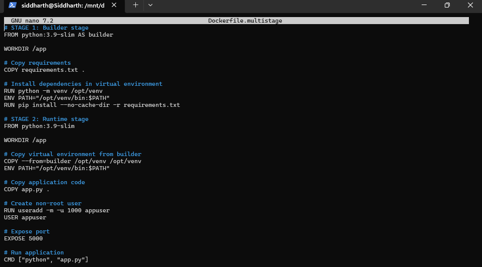

### **Step 3: Build and Compare**
```bash
# Build regular image
docker build -t flask-regular .
```


```bash
# Build multi-stage image
docker build -f Dockerfile.multistage -t flask-multistage .
```
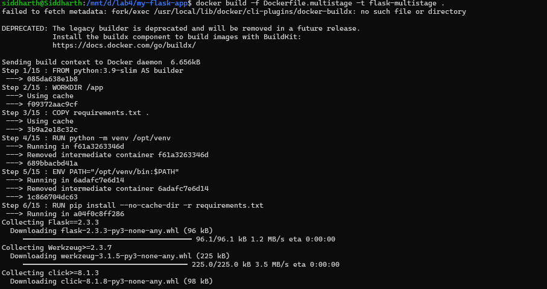

```bash
# Compare sizes
docker images | grep flask-

# Expected output:
# flask-regular     ~250MB
# flask-multistage  ~150MB (40% smaller!)
```
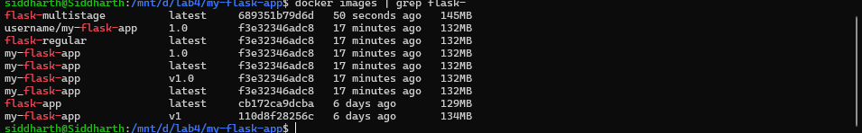

---

## **Part 6: Publishing to Docker Hub**

### **Step 1: Prepare for Publishing**
```bash
# Login to Docker Hub
docker login

# Tag image for Docker Hub
docker tag my-flask-app:latest username/my-flask-app:1.0
docker tag my-flask-app:latest username/my-flask-app:latest

# Push to Docker Hub
docker push username/my-flask-app:1.0
docker push username/my-flask-app:latest
```


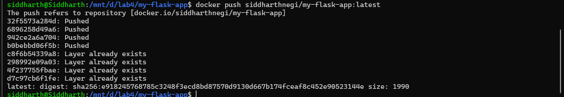


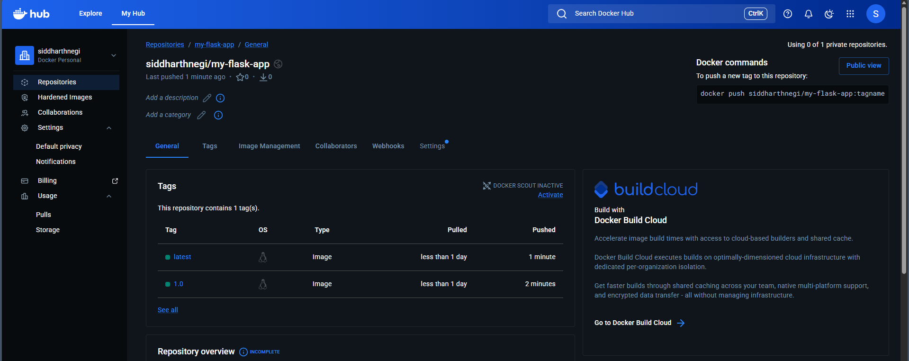

### **Step 2: Pull and Run from Docker Hub**
```bash
# Pull from Docker Hub (on another machine)
docker pull username/my-flask-app:latest

# Run the pulled image
docker run -d -p 5000:5000 username/my-flask-app:latest
```


---


