# Experiment 6 A
## Title: Comparison of Docker Run and Docker Compose


# PART A – THEORY

## 1. Objective

To understand the relationship between `docker run` and Docker Compose, and to compare their configuration syntax and use cases.

---

## 2. Background Theory

### 2.1 Docker Run (Imperative Approach)

The `docker run` command is used to create and start a container from an image. It requires explicit flags for:

* Port mapping (`-p`)
* Volume mounting (`-v`)
* Environment variables (`-e`)
* Network configuration (`--network`)
* Restart policies (`--restart`)
* Resource limits (`--memory`, `--cpus`)
* Container name (`--name`)

This approach is **imperative**, meaning you specify step-by-step instructions.

Example:

```bash
docker run -d \
  --name my-nginx \
  -p 8080:80 \
  -v ./html:/usr/share/nginx/html \
  -e NGINX_HOST=localhost \
  --restart unless-stopped \
  nginx:alpine
```

---

### 2.2 Docker Compose (Declarative Approach)

Docker Compose uses a YAML file (`docker-compose.yml`) to define services, networks, and volumes in a structured format.

Instead of multiple `docker run` commands, a single command is used:

```bash
docker compose up -d
```

Compose is **declarative**, meaning you define the desired state of the application.

Equivalent Compose file:

```yaml
version: '3.8'

services:
  nginx:
    image: nginx:alpine
    container_name: my-nginx
    ports:
      - "8080:80"
    volumes:
      - ./html:/usr/share/nginx/html
    environment:
      NGINX_HOST: localhost
    restart: unless-stopped
```

---

## 3. Mapping: Docker Run vs Docker Compose

| Docker Run Flag     | Docker Compose Equivalent        |
| ------------------- | -------------------------------- |
| `-p 8080:80`        | `ports:`                         |
| `-v host:container` | `volumes:`                       |
| `-e KEY=value`      | `environment:`                   |
| `--name`            | `container_name:`                |
| `--network`         | `networks:`                      |
| `--restart`         | `restart:`                       |
| `--memory`          | `deploy.resources.limits.memory` |
| `--cpus`            | `deploy.resources.limits.cpus`   |
| `-d`                | `docker compose up -d`           |

---

## 4. Advantages of Docker Compose

1. Simplifies multi-container applications
2. Provides reproducibility
3. Version controllable configuration
4. Unified lifecycle management
5. Supports service scaling

Example:

```bash
docker compose up --scale web=3
```

---

# PART B – PRACTICAL TASK

## Task 1: Single Container Comparison

### Step 1: Run Nginx Using Docker Run

Execute:

```bash
docker run -d \
  --name lab-nginx \
  -p 8081:80 \
  -v $(pwd)/html:/usr/share/nginx/html \
  nginx:alpine
```

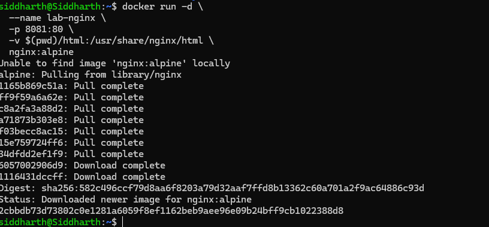

Verify:

```bash
docker ps
```

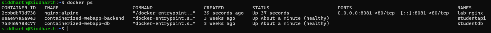

Access:

```
http://localhost:8081
```


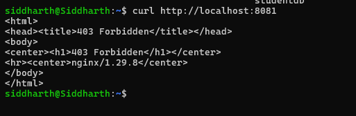

Stop and remove container:

```bash
docker stop lab-nginx
docker rm lab-nginx
```


---

### Step 2: Run Same Setup Using Docker Compose

Create `docker-compose.yml`:

```yaml
version: '3.8'

services:
  nginx:
    image: nginx:alpine
    container_name: lab-nginx
    ports:
      - "8081:80"
    volumes:
      - ./html:/usr/share/nginx/html
```

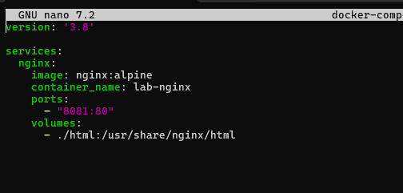

Run:

```bash
docker compose up -d
```

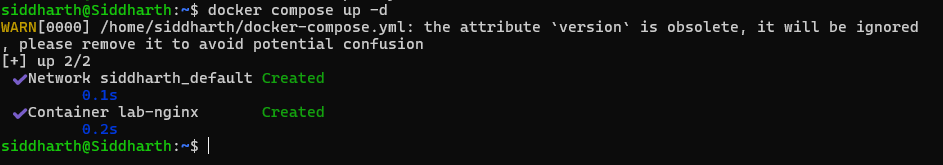

Verify:

```bash
docker compose ps
```

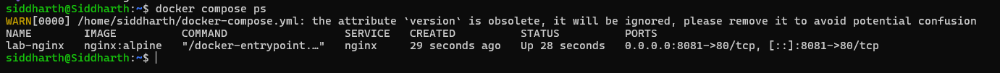

Stop:

```bash
docker compose down
```

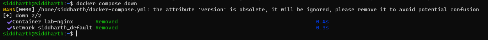

---

## Task 2: Multi-Container Application

### Objective:

Deploy WordPress with MySQL using:

1. Docker Run (manual way)
2. Docker Compose (structured way)

---

### A. Using Docker Run

1. Create network:

```bash
docker network create wp-net
```


2. Run MySQL:

```bash
docker run -d \
  --name mysql \
  --network wp-net \
  -e MYSQL_ROOT_PASSWORD=secret \
  -e MYSQL_DATABASE=wordpress \
  mysql:5.7
```

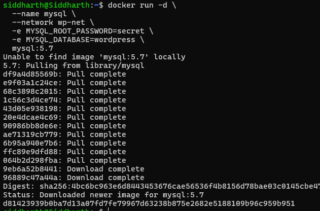

3. Run WordPress:

```bash
docker run -d \
  --name wordpress \
  --network wp-net \
  -p 8082:80 \
  -e WORDPRESS_DB_HOST=mysql \
  -e WORDPRESS_DB_PASSWORD=secret \
  wordpress:latest
```

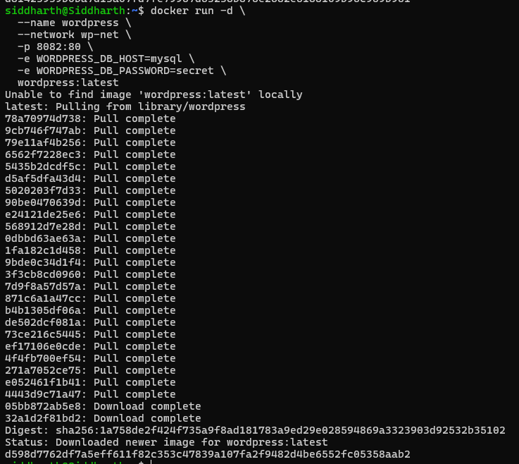

Test:

```
http://localhost:8082
```

---

### B. Using Docker Compose

Create `docker-compose.yml`:

```yaml
version: '3.8'

services:
  mysql:
    image: mysql:5.7
    environment:
      MYSQL_ROOT_PASSWORD: secret
      MYSQL_DATABASE: wordpress
    volumes:
      - mysql_data:/var/lib/mysql

  wordpress:
    image: wordpress:latest
    ports:
      - "8082:80"
    environment:
      WORDPRESS_DB_HOST: mysql
      WORDPRESS_DB_PASSWORD: secret
    depends_on:
      - mysql

volumes:
  mysql_data:
```

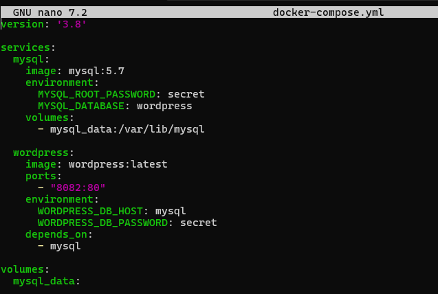

Run:

```bash
docker compose up -d
```
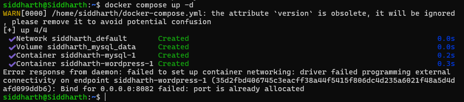
Stop:

```bash
docker compose down -v
```
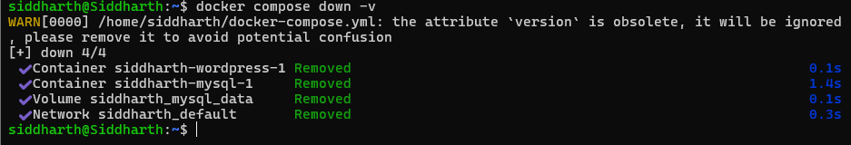
---


# PART C – CONVERSION & BUILD-BASED TASKS

## Task 3: Convert Docker Run to Docker Compose

### Problem 1: Basic Web Application

### Given Docker Run Command:

```bash
docker run -d \
  --name webapp \
  -p 5000:5000 \
  -e APP_ENV=production \
  -e DEBUG=false \
  --restart unless-stopped \
  node:18-alpine
```

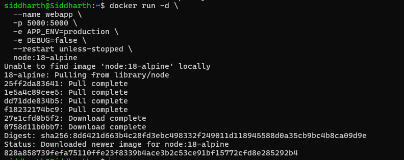

---

### Student Task:

1. Write an equivalent `docker-compose.yml`
2. Ensure:

   * Same container name
   * Same port mapping
   * Same environment variables
   * Same restart policy
3. Run using:

   ```bash
   docker compose up -d
   ```
   
4. Verify using:

   ```bash
   docker compose ps
   ```
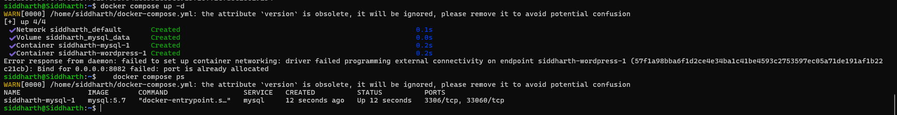
---

## Problem 2: Volume + Network Configuration

### Given Docker Run Commands:

```bash
docker network create app-net
```

```bash
docker run -d \
  --name postgres-db \
  --network app-net \
  -e POSTGRES_USER=admin \
  -e POSTGRES_PASSWORD=secret \
  -v pgdata:/var/lib/postgresql/data \
  postgres:15
```

```bash
docker run -d \
  --name backend \
  --network app-net \
  -p 8000:8000 \
  -e DB_HOST=postgres-db \
  -e DB_USER=admin \
  -e DB_PASS=secret \
  python:3.11-slim
```
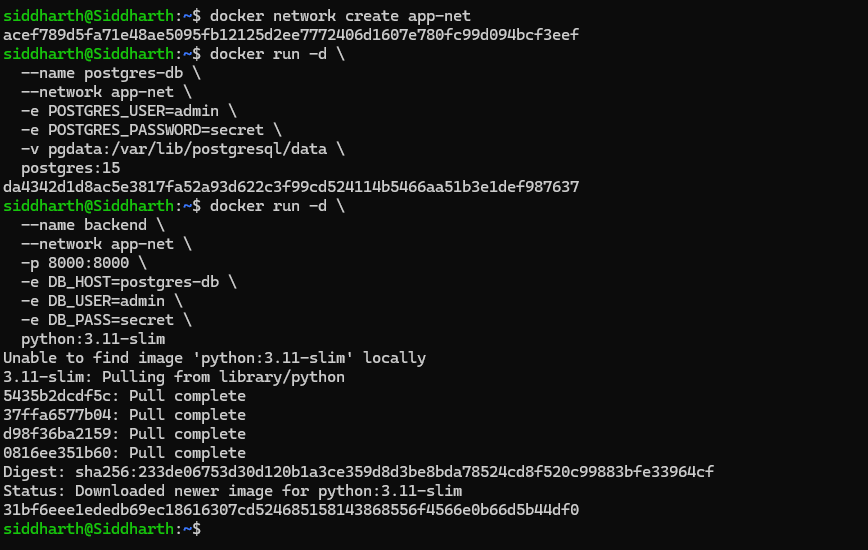
---

### Student Task:

1. Create a single `docker-compose.yml` file that:

   * Defines both services
   * Creates named volume `pgdata`
   * Creates custom network `app-net`
   * Uses `depends_on`

   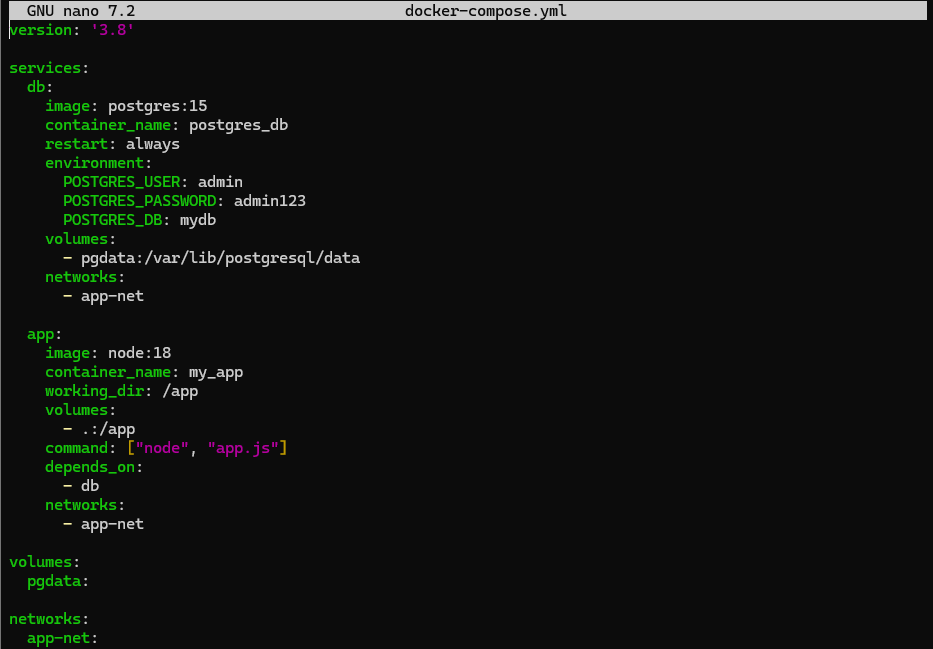

2. Bring up services using one command.

    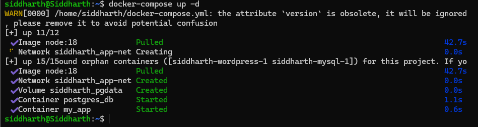

3. Stop and remove everything properly.

    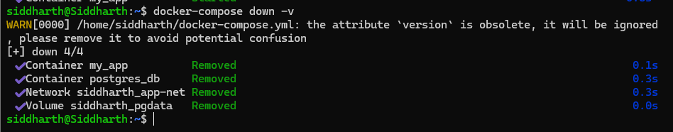

---

## Task 4: Resource Limits Conversion

### Given Docker Run Command:

```bash
docker run -d \
  --name limited-app \
  -p 9000:9000 \
  --memory="256m" \
  --cpus="0.5" \
  --restart always \
  nginx:alpine
```

---

### Student Task:

1. Convert this to Docker Compose.

2. Add resource limits using:

   ```yaml
   deploy:
     resources:
       limits:
   ```
   Use direct resource flags:
   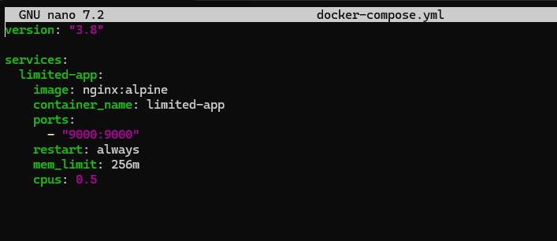

3. Explain:

   * When `deploy` works
      The deploy section in docker-compose.yml is part of the Docker Swarm orchestration model.

      It works ONLY when:
      Docker is in Swarm mode
      You use:
       ```
        docker swarm init
        docker stack deploy -c docker-compose.yml myapp
      ```
      It does NOT work when:
      ```
      docker-compose up
      or
      docker compose up
       ```
      In this case, the entire deploy block is ignored silently

      Why?
      Because:
      docker-compose = local container runtime tool
      deploy = cluster-level orchestration configuration
      So Compose simply doesn’t process it.

   * Difference between normal Compose mode and Swarm mode
      Difference Between Docker Compose Mode and Docker Swarm Mode
      1. Conceptual Role

          Docker Compose Mode is a local orchestration tool designed to define and run multi-container applications on a single host. It focuses on simplicity and developer productivity.

          Docker Swarm Mode is a native clustering and orchestration system in Docker that manages containers across multiple machines (nodes). It is intended for distributed, production-grade deployments.

      2. Deployment Scope
        Compose Mode: Operates on a single machine. All containers run on the same Docker engine.
        Swarm Mode: Operates on a cluster of machines (manager and worker nodes). Containers are distributed across nodes.

      3. Command and Execution Model
        Compose Mode:
        Command: docker-compose up or docker compose up
        Directly creates and starts containers
        Swarm Mode:
        Commands:
        ```
        docker swarm init (initialize cluster)
        docker stack deploy -c docker-compose.yml <stack_name>
        ```
        Deploys services (not just containers) across the cluster

      4. Resource Management
        Compose Mode:
        Uses container-level constraints like:
        mem_limit
        cpus
        Does not support the deploy section
        Swarm Mode:

        Uses:
        deploy:
        resources:
        limits:
        Enforces resource allocation at the orchestration level

      5. Service Abstraction
        Compose Mode:
        Works with individual containers
        No concept of service abstraction beyond grouping
        Swarm Mode:
        Uses services as the primary unit
        A service can run multiple container instances (replicas)

      6. Scaling
        Compose Mode:
        Scaling is manual and limited:
        docker-compose up --scale app=3
        No automatic load distribution
        Swarm Mode:
        Built-in scaling:
        deploy:
        replicas: 3
        Automatically distributes replicas across nodes

      7. Load Balancing
        Compose Mode:
        No built-in load balancing
        Requires external tools
        Swarm Mode:
        Built-in internal load balancer
        Requests are automatically distributed across replicas

      8. Fault Tolerance and Self-Healing
        Compose Mode:
        Limited to restart policies (e.g., restart: always)
        No automatic rescheduling if a node fails
        Swarm Mode:
        Self-healing system
        If a container or node fails, Swarm automatically reschedules tasks on another node

      9. Networking
        Compose Mode:
        Creates isolated networks on a single host
        Service discovery via container names
        Swarm Mode:
        Uses overlay networks across multiple nodes
        Enables inter-node communication and service discovery

      10. Use Cases
        Compose Mode:
        Development and testing environments
        Local multi-container setups
        Swarm Mode:
        Production environments
        Distributed and scalable applications

      Summary

        Docker Compose is suitable for local, single-host environments where simplicity and quick setup are priorities. Docker Swarm is designed for distributed systems, offering orchestration features such as scaling, load balancing, and fault tolerance across multiple nodes.

---

# Experiment 6 B 
## Multi-Container Application using Docker Compose (WordPress + Database)**

### **1. Objective**

To deploy a multi-container application using **Docker Compose**, consisting of:

* **WordPress (frontend + PHP)**
* **MySQL database (backend)**

Also:

* Understand container networking & volumes
* Learn how to scale services
* Compare with **Docker Swarm** for production deployment


### **2. Prerequisites**

* Docker installed
* Docker Compose (comes with modern Docker)
* Basic understanding of containers


### **3. Architecture Overview**

```
User (Browser)
      |
   WordPress Container
      |
   MySQL Container
      |
   Persistent Volume (Database Storage)
```

* WordPress connects to MySQL using service name (DNS inside Docker network)
* Data is persisted using volumes

---
## Steps

### **Step 1: Create Project Directory**

```bash
mkdir wp-compose-lab
cd wp-compose-lab
```


---

### **Step 2: Create docker-compose.yml**

```yaml
version: '3.9'

services:
  db:
    image: mysql:5.7
    container_name: wordpress_db
    restart: always
    environment:
      MYSQL_ROOT_PASSWORD: rootpass
      MYSQL_DATABASE: wordpress
      MYSQL_USER: wpuser
      MYSQL_PASSWORD: wppass
    volumes:
      - db_data:/var/lib/mysql

  wordpress:
    image: wordpress:latest
    container_name: wordpress_app
    depends_on:
      - db
    ports:
      - "8080:80"
    restart: always
    environment:
      WORDPRESS_DB_HOST: db:3306
      WORDPRESS_DB_USER: wpuser
      WORDPRESS_DB_PASSWORD: wppass
      WORDPRESS_DB_NAME: wordpress
    volumes:
      - wp_data:/var/www/html

volumes:
  db_data:
  wp_data:
```
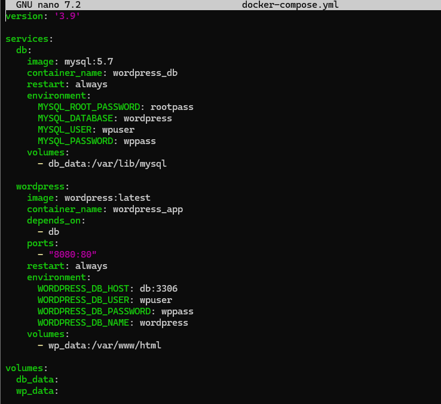
---

### **Explanation of Key Sections**

#### **services**

Defines containers:

* `db` → MySQL database
* `wordpress` → application

#### **depends_on**

* Ensures DB starts before WordPress

#### **environment**

* Used to configure DB credentials and connection

#### **volumes**

* Persist data even if containers are deleted

#### **ports**

* Exposes WordPress on:

  ```
  http://localhost:8080
  ```


### **Step 3: Start Application**

```bash
docker-compose up -d
```
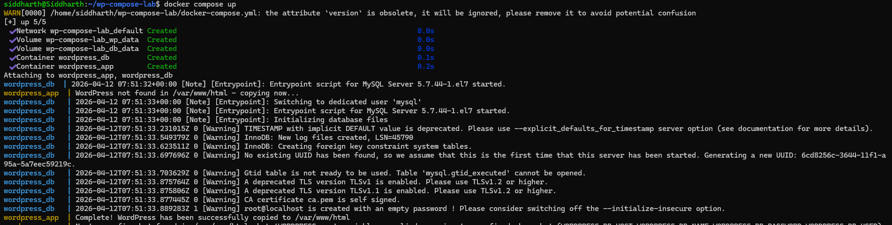


What happens:

* Images are pulled
* Network is created
* Containers are started
* DNS-based service discovery enabled


### **Step 4: Verify Containers**

```bash
docker ps
```
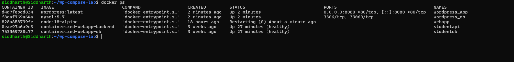

Expected:

* wordpress_app
* wordpress_db


### **Step 5: Access WordPress**

Open browser:

```
http://localhost:8080
```
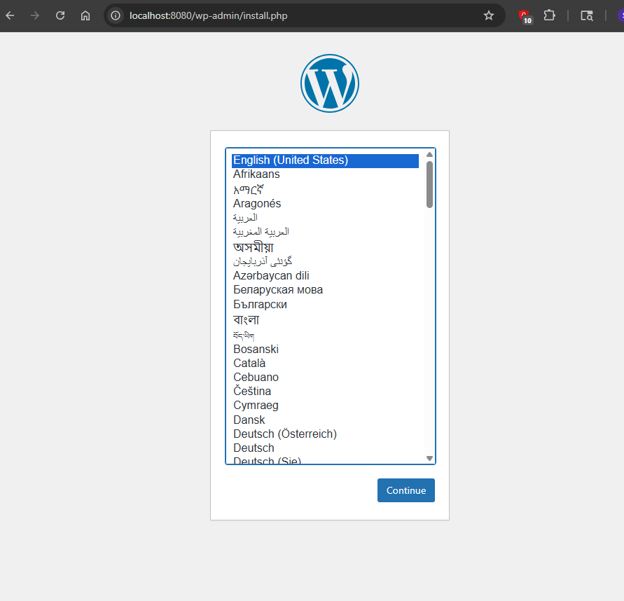

* Complete WordPress setup
* Enter site title, admin user, password


### **Step 6: Check Volumes**

```bash
docker volume ls
```
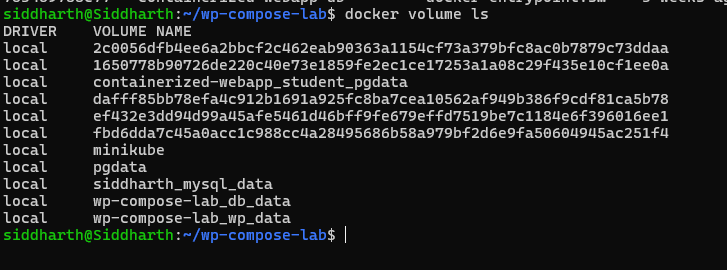

* `db_data` → database persistence
* `wp_data` → WordPress files


### **Step 7: Stop Application**

```bash
docker-compose down
```
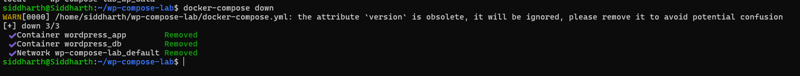

* Containers removed
* Volumes remain intact

---

## **5. Scaling in Docker Compose**


### **Method 1: Scale WordPress Containers**

```bash
docker-compose up --scale wordpress=3
```

Result:

* 3 WordPress containers running

**Problem:**

* All try to use same port (8080)
* No load balancing


### **Solution: Use Reverse Proxy (Nginx)**

Add another service:

```yaml
nginx:
  image: nginx:latest
  ports:
    - "8080:80"
```

Then configure load balancing manually.


### **Limitations of Compose Scaling**

* No built-in load balancing
* No auto-healing
* Single host only
* Not production-ready for scaling

---

## **6. Running Same Setup with Docker Swarm**


### **Step 1: Initialize Swarm**

```bash
docker swarm init
```


### **Step 2: Deploy Stack**

```bash
docker stack deploy -c docker-compose.yml wpstack
```


### **Step 3: Scale Service**

```bash
docker service scale wpstack_wordpress=3
```


### **What Changes in Swarm?**

| Feature         | Docker Compose | Docker Swarm       |
| --------------- | -------------- | ------------------ |
| Scope           | Single host    | Multi-node cluster |
| Scaling         | Manual         | Built-in           |
| Load balancing  | No             | Yes (internal LB)  |
| Self-healing    | No             | Yes                |
| Rolling updates | No             | Yes                |
| Networking      | Basic          | Overlay network    |


## **7. Benefits of Docker Swarm**

* Built-in load balancing
* Automatic container restart (self-healing)
* Horizontal scaling across nodes
* Rolling updates without downtime
* Service abstraction (not individual containers)


## **8. Challenges / Limitations of Swarm**

* Less popular than Kubernetes
* Limited ecosystem
* Less flexible scheduling
* Fewer enterprise features


## **9. Key Learning Outcomes**

* Multi-container apps require orchestration

* Docker Compose is ideal for:

  * Development
  * Testing
  * Learning

* Docker Swarm is useful for:

  * Simple production clusters
  * Easy scaling without Kubernetes complexity

---

## **10. Conclusion**

This experiment demonstrated:

* How to deploy **WordPress + MySQL** using Docker Compose
* How containers communicate using internal networking
* Importance of **volumes for persistence**
* Scaling limitations of Compose
* Advantages of using **Docker Swarm for production-ready deployments**


