# Lab Experiment 7

## CI/CD Pipeline using Jenkins, GitHub & Docker Hub

### Aim: Design and implement a complete CI/CD pipeline using Jenkins, integrating source code from GitHub, and building & pushing Docker images to Docker Hub.

---
### GitHub repository link
[](https://github.com/Pavilioni5/my-app)


## Theory

### What is CI/CD?

**CI/CD** stands for **Continuous Integration** and **Continuous Deployment/Delivery**. It is a modern software development practice that automates the process of building, testing, and deploying code every time a developer makes a change.

#### Continuous Integration (CI)
Before CI existed, developers would write code separately for days or weeks, then try to merge everything together — this often caused conflicts and bugs that were very hard to find. CI solves this by automatically building and testing the code every time a developer pushes changes to the shared repository.

- Every `git push` triggers an automated build
- Problems are caught immediately, not weeks later
- The codebase is always in a working, stable state

#### Continuous Deployment (CD)
CD takes the output of CI (a tested, built artifact) and automatically delivers it to its destination — in our case, Docker Hub.

- No manual steps needed after code is pushed
- The Docker image is always up to date on Docker Hub
- Speeds up the release cycle significantly

#### The CI/CD Pipeline Concept
A **pipeline** is a sequence of automated steps that code passes through from commit to deployment. Think of it like an assembly line in a factory:

```
Raw Material (Code)
       ↓
  Station 1: Clone    → Pull latest code
       ↓
  Station 2: Build    → Create Docker image
       ↓
  Station 3: Auth     → Login to Docker Hub
       ↓
  Station 4: Push     → Upload image to Docker Hub
       ↓
  Final Product: Image available globally 
```

**Without CI/CD:** Developer pushes code → manually builds image → manually logs into Docker Hub → manually pushes image *(slow, error-prone, skippable)*

**With CI/CD:** Developer pushes code → **everything else is automatic** *(fast, consistent, reliable)*

---

### What is Jenkins?

Jenkins is an open-source **automation server** with a browser-based graphical interface (GUI). It acts as the **brain** of the CI/CD pipeline — it listens for triggers, runs pipeline stages in order, and reports results.

#### Key features of Jenkins:
- **Dashboard UI** — View all jobs, their status (success/fail), and build history from a browser
- **Plugin Ecosystem** — Hundreds of plugins to integrate with GitHub, Docker, Slack, AWS, and more
- **Pipeline as Code** — Pipelines are defined in a `Jenkinsfile` stored alongside the source code
- **Credentials Store** — Securely stores passwords and tokens so they are never hardcoded in pipeline scripts
- **Agent System** — Jenkins can delegate work to other machines (agents); in our experiment, the same Docker host is used as the agent

#### How Jenkins fits in this experiment:
Jenkins is the **orchestrator**. It receives the webhook signal from GitHub, reads the `Jenkinsfile` from the repository, and executes each stage (Clone → Build → Login → Push) one by one automatically.

---

### What is a Webhook?

A **webhook** is an HTTP-based notification mechanism. Instead of Jenkins constantly checking ("polling") GitHub every few minutes to see if there is new code, GitHub **proactively notifies** Jenkins the moment a push event happens.

#### How a webhook works step by step:
1. Developer pushes code to GitHub
2. GitHub immediately sends an HTTP POST request to Jenkins at: `http://<jenkins-server>:8080/github-webhook/`
3. Jenkins receives the notification and starts the pipeline automatically

This makes the pipeline **event-driven** — Jenkins starts building within seconds of a push with zero manual intervention.

#### Webhook vs Polling:

| Method | How it works | Efficiency |
|---|---|---|
| **Polling** | Jenkins checks GitHub every N minutes | Wasteful — checks even when nothing changed |
| **Webhook** | GitHub notifies Jenkins instantly on push | Efficient — triggers only when needed |

---

### What is a Jenkinsfile?

A **Jenkinsfile** is a text file that contains the pipeline definition written in **Groovy DSL** (Domain Specific Language). It tells Jenkins exactly what to do and in what order.

Storing the Jenkinsfile in the repository (alongside the code) means:
- The pipeline is **version-controlled** — you can see the history of pipeline changes
- Any team member can read and understand how the pipeline works
- If the pipeline breaks after a change, you can roll it back like any other code

The Jenkinsfile follows a declarative syntax with a clear hierarchy:

```
pipeline
  └── agent          ← where to run
  └── environment    ← shared variables
  └── stages
        └── stage('Name')
              └── steps
                    └── sh / git / withCredentials / echo
```

---

### How They All Work Together

```
┌─────────────┐    git push    ┌──────────────┐  HTTP POST  ┌──────────────┐
│             │ ─────────────► │              │ ──────────► │              │
│  Developer  │                │   GitHub     │  (webhook)  │   Jenkins    │
│             │                │              │             │              │
└─────────────┘                └──────────────┘             └──────┬───────┘
                                                                   │
                                                    Reads Jenkinsfile
                                                    Executes stages:
                                                    │
                                              ┌─────▼──────────────────────┐
                                              │  Stage 1: git clone        │
                                              │  Stage 2: docker build     │
                                              │  Stage 3: docker login     │
                                              │  Stage 4: docker push      │
                                              └─────────────┬──────────────┘
                                                            │
                                                            ▼
                                                   ┌──────────────┐
                                                   │  Docker Hub  │
                                                   │  Image ready │
                                                   │  globally    │
                                                   └──────────────┘
```

---

## Prerequisites

- Docker & Docker Compose installed on host machine
- GitHub account with a repository
- Docker Hub account with an access token
- Basic Linux command knowledge

---

## Project Structure

```
my-app/
├── app.py              # Flask web application
├── requirements.txt    # Python dependencies
├── Dockerfile          # Docker image build instructions
└── Jenkinsfile         # CI/CD pipeline definition
```

---

## Part A — GitHub Repository Setup

### app.py — Detailed Code Explanation

```python
from flask import Flask           
app = Flask(__name__)             

@app.route("/")                   
def home():                       
    return "Hello from CI/CD Pipeline - Updated! from Jenkinsfile"  

app.run(host="0.0.0.0", port=80)  
```

**Code:  `app.run(host="0.0.0.0", port=80)`**
Starts the Flask development web server with two important parameters:
- `host="0.0.0.0"` — Makes the server listen on **all available network interfaces**, not just the loopback address (`127.0.0.1`). This is essential inside Docker — without it, the Flask server would only be reachable from inside the container itself and not from the outside world.
- `port=80` — Runs on port 80, which is the standard HTTP port. This matches the `EXPOSE 80` instruction in the Dockerfile.

**`requirements.txt`**
```
flask
```
Lists all Python packages needed for the app. When Docker builds the image, it runs `pip install -r requirements.txt`, which reads this file and installs Flask and all its sub-dependencies automatically.

---

### Dockerfile — Detailed Code Explanation

```dockerfile
FROM python:3.10-slim               
WORKDIR /app                       
COPY . .                            
RUN pip install -r requirements.txt 
EXPOSE 80                           
CMD ["python", "app.py"]           
```

This Dockerfile creates a lightweight environment to run your Flask app. It starts with a slim Python 3.10 base image to keep the file size small and sets /app as the active workspace. The COPY command pulls your local code into the container, while RUN installs the necessary dependencies during the build process. Finally, it documents Port 80 as the entry point and uses CMD to automatically launch the script whenever the container is started.

**How Docker builds the image layer by layer:**

```
┌───────────────────────────────────────┐
│  Layer 5: EXPOSE metadata             │  ← EXPOSE 80
├───────────────────────────────────────┤
│  Layer 4: flask + deps installed      │  ← RUN pip install
├───────────────────────────────────────┤
│  Layer 3: app files copied to /app    │  ← COPY . .
├───────────────────────────────────────┤
│  Layer 2: /app directory created      │  ← WORKDIR /app
├───────────────────────────────────────┤
│  Layer 1: python:3.10-slim base       │  ← FROM python:3.10-slim
└───────────────────────────────────────┘
  [Runtime — not a layer]: python app.py  ← CMD
```

---

### Jenkinsfile — Detailed Code Explanation

```groovy
pipeline {
    agent any

    environment {
        IMAGE_NAME = "anketkiran/myapp"
    }

    stages {
        stage('Clone Source') {
            steps {
                git branch: 'main', url: 'https://github.com/Pavilioni5/my-app.git'
            }
        }

        stage('Build Docker Image') {
            steps {
                sh 'docker build -t $IMAGE_NAME:latest .'
            }
        }

        stage('Login to Docker Hub') {
            steps {
                withCredentials([string(credentialsId: 'dockerhub-token', variable: 'DOCKER_TOKEN')]) {
                    sh 'echo $DOCKER_TOKEN | docker login -u anketkiran --password-stdin'
                }
            }
        }

        stage('Push to Docker Hub') {
            steps {
                sh 'docker push $IMAGE_NAME:latest'
            }
        }
    }
}
```


`pipeline {}` is the main block that defines the entire Jenkins pipeline.

#### `agent any`
Specifies **where the pipeline runs**. `any` means *"use whatever build node is available."* In our setup, Jenkins runs inside Docker with the host's Docker socket mounted, so the pipeline executes directly on the host machine. This means `docker build` and `docker push` commands operate on the real Docker engine of the host.

#### `environment { IMAGE_NAME = "anketkiran/myapp" }`
Defines **environment variables** that are available to all stages throughout the pipeline. Setting `IMAGE_NAME` here avoids repeating the full image name in every stage. If you need to rename the image, you change it once here.

- Format follows Docker Hub convention: `<dockerhub-username>/<repository-name>`
- Referenced in shell commands as `$IMAGE_NAME`

---

#### Stage 1 — `'Clone Source'`

```groovy
git branch: 'main', url: 'https://github.com/Pavilioni5/my-app.git'
```

The `git` step is a built-in Jenkins step that clones a Git repository into the Jenkins workspace directory. Parameters explained:
- `branch: 'main'` — Specifically checks out the `main` branch (not any other branch like `dev` or `feature/xyz`)
- `url: '...'` — The HTTPS URL of the GitHub repository to clone from

After this step, all project files (app.py, Dockerfile, requirements.txt, Jenkinsfile) are available in Jenkins' workspace and can be used by subsequent stages.

---

#### Stage 2 — `'Build Docker Image'`

```groovy
sh 'docker build -t $IMAGE_NAME:latest .'
```

`sh` runs a shell command on the build agent. Breaking down the full Docker command:

- `docker build` — Instructs Docker to build an image using a Dockerfile
- `-t $IMAGE_NAME:latest` — Tags the built image. `-t` stands for **tag**. `$IMAGE_NAME` expands to `anketkiran/myapp`, making the full tag `anketkiran/myapp:latest`
- `.` — The **build context** — tells Docker to look for the Dockerfile in the current directory (the Jenkins workspace where the code was cloned in Stage 1)


---

#### Stage 3 — `'Login to Docker Hub'`

```groovy
withCredentials([string(credentialsId: 'dockerhub-token', variable: 'DOCKER_TOKEN')]) {
    sh 'echo $DOCKER_TOKEN | docker login -u anketkiran --password-stdin'
}
```

This is the most security-critical stage.

**`withCredentials([...])`**
A Jenkins DSL function that temporarily retrieves a secret from Jenkins' encrypted credentials store and makes it available as an environment variable only inside the `{ }` block. Once the block finishes, the variable is destroyed and scrubbed from memory. Jenkins also masks the secret value in build logs, replacing it with `****`.

**`string(credentialsId: 'dockerhub-token', variable: 'DOCKER_TOKEN')`**
This is the credential binding inside the list `[...]`:
- `string` — Declares the credential type as a secret text string (as opposed to `usernamePassword`, `sshUserPrivateKey`, `file`, etc.)
- `credentialsId: 'dockerhub-token'` — The exact ID used when the token was saved in Jenkins credentials. Jenkins looks up and decrypts the value using this ID.
- `variable: 'DOCKER_TOKEN'` — The name of the temporary environment variable that will hold the decrypted token inside the block

**`echo $DOCKER_TOKEN | docker login -u anketkiran --password-stdin`**

This is a **Unix pipe command** — two commands connected by `|`:

| Part | What it does |
|---|---|
| `echo $DOCKER_TOKEN` | Prints the token value to standard output (stdout) |
| `\|` | Pipes stdout of the left command into stdin of the right command |
| `docker login -u anketkiran` | Initiates Docker Hub login for user `anketkiran` |
| `--password-stdin` | Reads the password from standard input (the pipe) instead of as a command argument |

---

#### Stage 4 — `'Push to Docker Hub'`

```groovy
sh 'docker push $IMAGE_NAME:latest'
```

Uploads the locally built image to Docker Hub. This works because:
1. The previous stage successfully authenticated with Docker Hub (the auth session is stored by Docker on the host)
2. The image is tagged as `anketkiran/myapp:latest` — which maps to the `myapp` repository under the `anketkiran` Docker Hub account

After this stage completes, the image is publicly available and can be pulled by anyone with:
```bash
docker pull anketkiran/myapp:latest
```


---

## Part B — Jenkins Setup using Docker

### docker-compose.yml — Detailed Code Explanation

```yaml
version: '3.8'
services:
  jenkins:
    image: jenkins/jenkins:lts
    container_name: jenkins
    restart: always
    ports:
      - "8080:8080"
      - "50000:50000"
    volumes:
      - jenkins_home:/var/jenkins_home
      - /var/run/docker.sock:/var/run/docker.sock
    user: root

volumes:
  jenkins_home:
```

This Docker Compose file configures a stable Jenkins LTS container designed for persistent CI/CD workflows. It ensures high availability with a restart: always policy and maps essential ports for web access (8080) and agent connections (50000). To prevent data loss, a named volume persists all Jenkins configurations and build history on the host machine. Most importantly, it mounts the Docker socket and runs as root, granting Jenkins the necessary permissions to build and manage Docker images directly on the host's engine.

### Start Jenkins

```bash
docker-compose up -d
```

- `up` — Create and start all services defined in `docker-compose.yml`
- `-d` — Detached mode: run containers in the background, freeing up your terminal

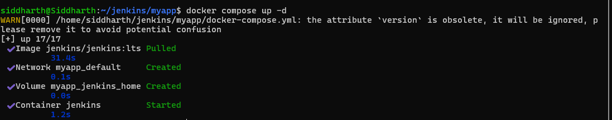

### Access Jenkins

```
http://localhost:8080
```
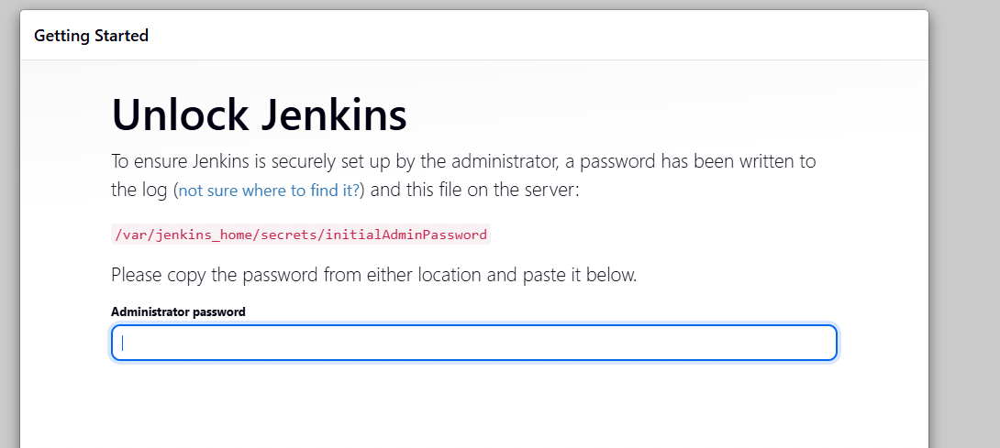
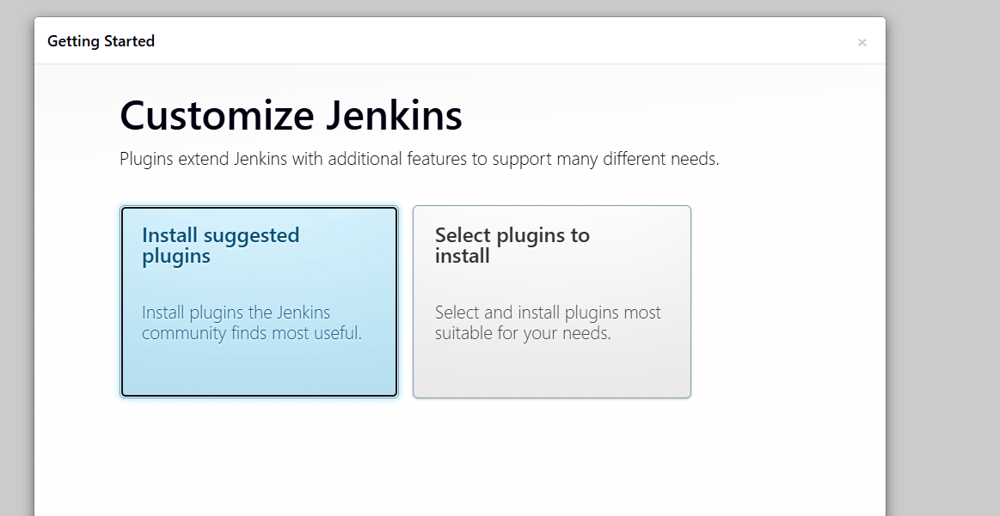
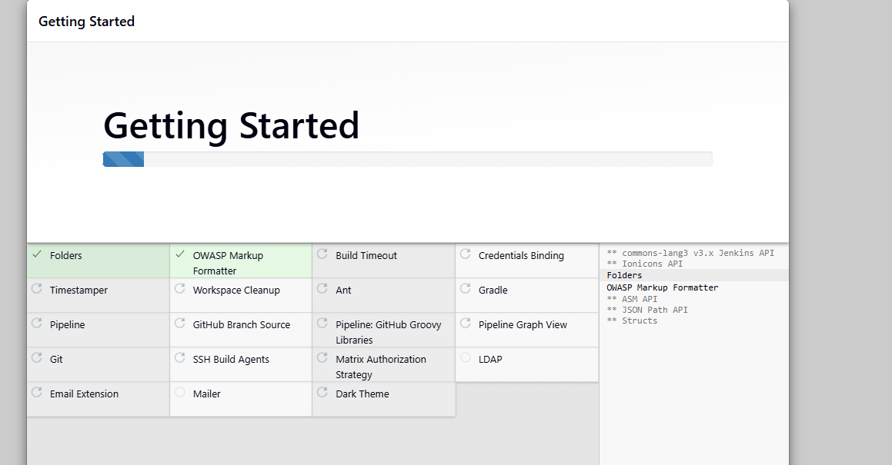

### Unlock Jenkins

```bash
docker exec -it jenkins cat /var/jenkins_home/secrets/initialAdminPassword
```

- `docker exec` — Execute a command inside a running container
- `-it` — Allocate an interactive pseudo-TTY
- `jenkins` — The container name to target
- `cat /var/jenkins_home/secrets/initialAdminPassword` — Print the one-time admin password generated on first startup

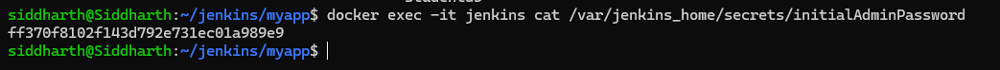

### Initial Setup Steps

1. Paste the password into the unlock screen
2. Click **"Install suggested plugins"** and wait for installation to complete
3. Create your **admin user** (set username and password)
4. Save and proceed to the Jenkins dashboard

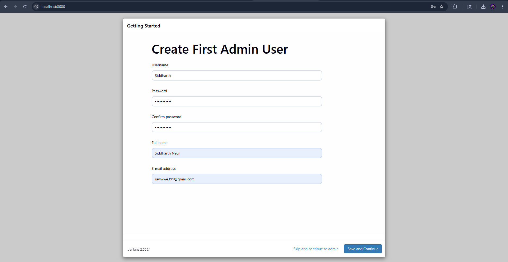

---

## Part C — Jenkins Configuration

### Step 1: Add Docker Hub Credentials

Navigate to:
```
Manage Jenkins → Credentials → (global) → Add Credentials
```

| Field | Value |
|---|---|
| **Kind** | Secret text |
| **Secret** | Your Docker Hub Access Token (from Docker Hub → Account Settings → Security) |
| **ID** | `dockerhub-token` |
| **Description** | Docker Hub Token |

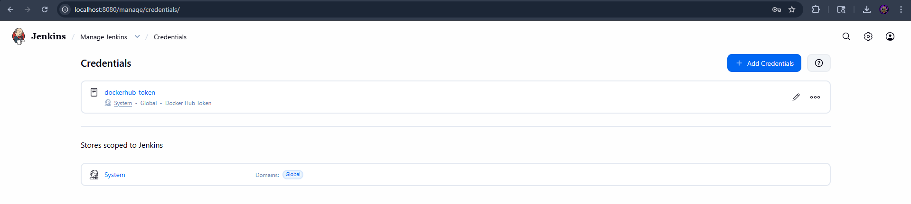

> ⚠️ The `credentialsId: 'dockerhub-token'` in the Jenkinsfile must **exactly match** the ID you enter here — including case sensitivity.

### Step 2: Create a Pipeline Job

1. Click **New Item** on the Jenkins dashboard
2. Enter name: `ci-cd-pipeline`
3. Select **Pipeline** and click OK
4. Under the **Pipeline** section, configure:

| Field | Value |
|---|---|
| **Definition** | Pipeline script from SCM |
| **SCM** | Git |
| **Repository URL** | `https://github.com/Pavilioni5/my-app.git` |
| **Branch Specifier** | `*/main` |
| **Script Path** | `Jenkinsfile` |

5. Click **Save**

**Why "Pipeline script from SCM"?**
This tells Jenkins to fetch the `Jenkinsfile` directly from the GitHub repository rather than copying it into the Jenkins UI. The pipeline definition lives with the code and is version-controlled — changes to the Jenkinsfile are tracked in Git history just like any other file.

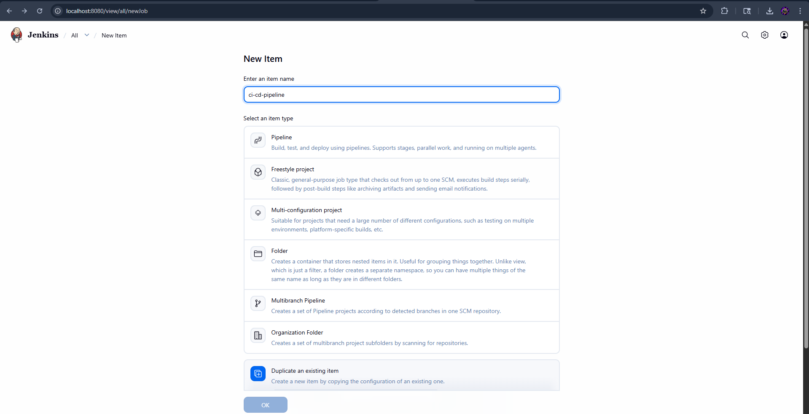

---

## Part D — GitHub Webhook Integration

### Configure Webhook in GitHub

Go to your GitHub repository:
```
Settings → Webhooks → Add Webhook
```

| Field | Value |
|---|---|
| **Payload URL** | `http://<your-server-ip>:8080/github-webhook/` |
| **Content type** | `application/json` |
| **Which events** | Just the push event |

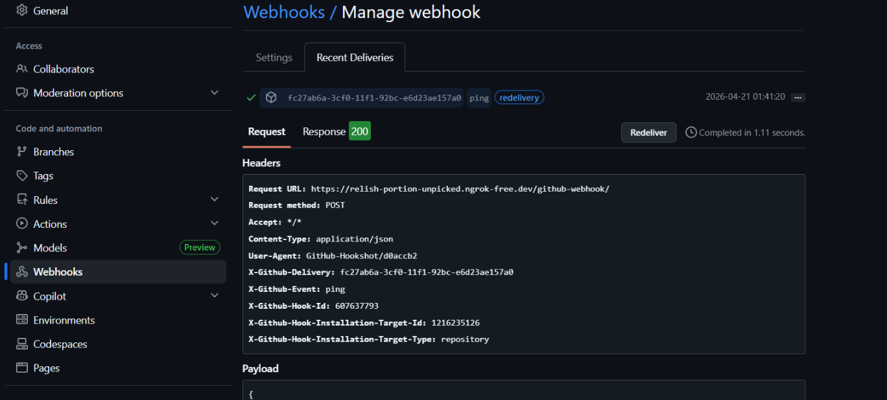

### Enable Webhook Trigger in Jenkins

In your pipeline job → **Configure**:
- Check  **"GitHub hook trigger for GITScm polling"**

Now every `git push` to the repository will automatically trigger a new Jenkins build.

---

## Part E — Execution Flow

```
1. Developer: git push → GitHub
                              ↓
2. GitHub sends HTTP POST → Jenkins (webhook)
                              ↓
3. Jenkins reads Jenkinsfile and executes:
   │
   ├─ Stage 1 [Clone Source]
   │     git clone https://github.com/Pavilioni5/my-app.git (branch: main)
   │
   ├─ Stage 2 [Build Docker Image]
   │     docker build -t anketkiran/myapp:latest .
   │
   ├─ Stage 3 [Login to Docker Hub]
   │     echo $DOCKER_TOKEN | docker login -u anketkiran --password-stdin
   │
   └─ Stage 4 [Push to Docker Hub]
         docker push anketkiran/myapp:latest
                              ↓
4. Image available on Docker Hub 
   docker pull anketkiran/myapp:latest  ← works from anywhere
```

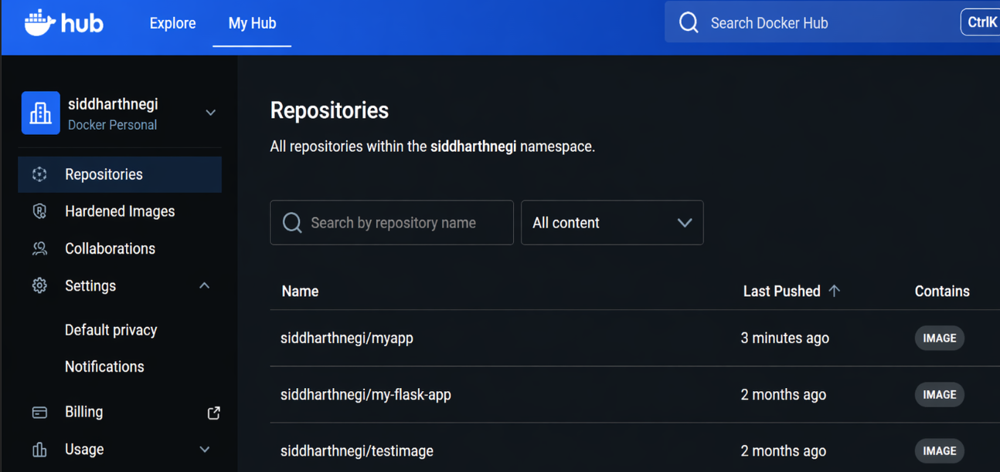

### Before connected to webhook
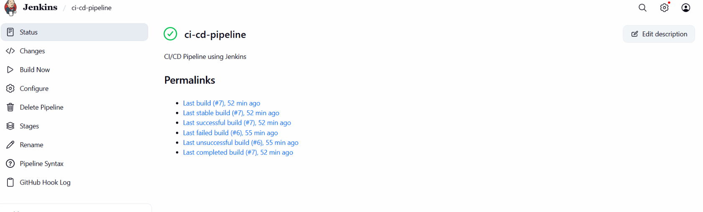
### pipeline 
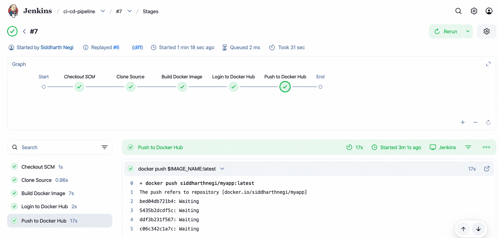

### After connected to webhook
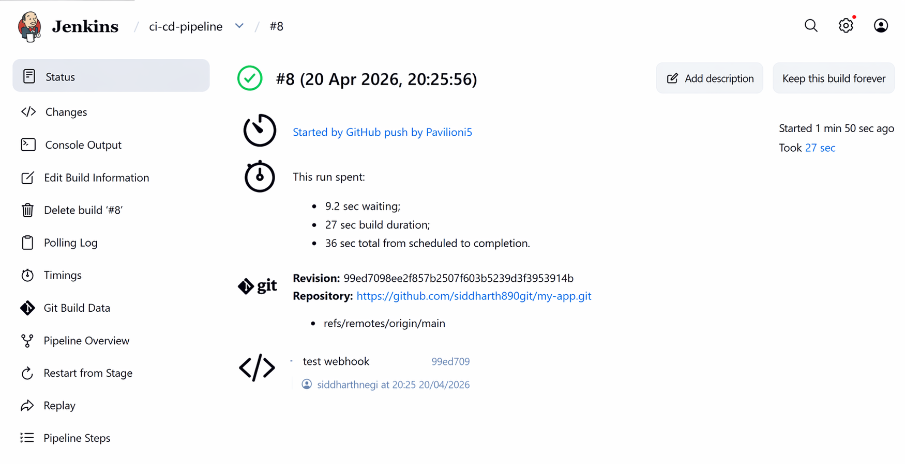

### Shared by GitHub Push
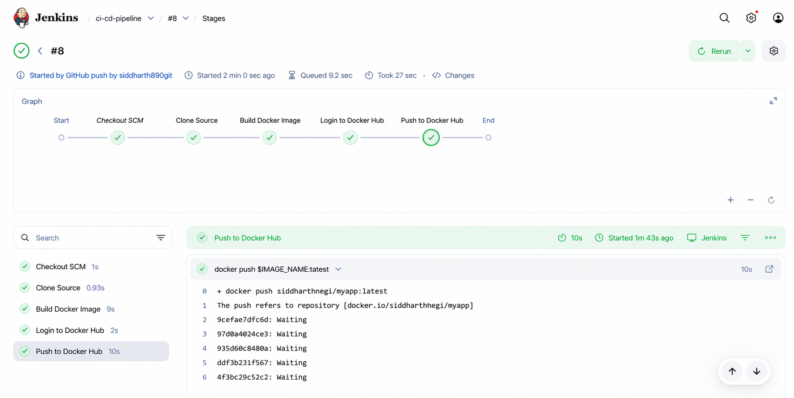
---

# Troubleshooting 

## Issue 1 — localhost / Private IP Not Accessible

When setting up the GitHub webhook, the following URLs were tried:

```
http://localhost:8080/github-webhook/
http://192.168.x.x:8080/github-webhook/
```
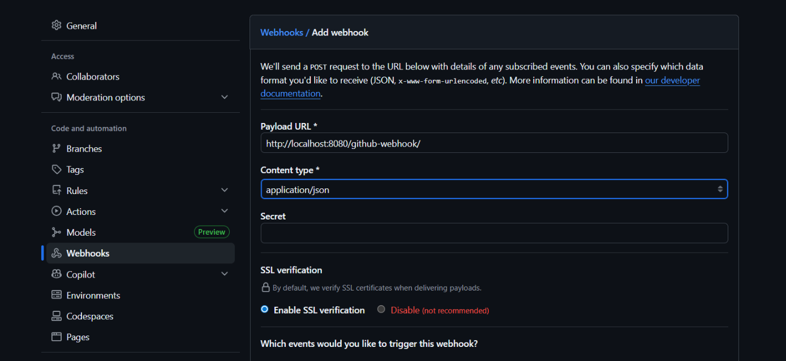

**Why this fails:**

`192.168.x.x` is a **private IP address** (RFC 1918 range). Private IPs are only routable within your local network (home/office LAN). They are blocked at the network boundary and cannot be reached from the public internet. GitHub's servers sit on the public internet and have no path to your local `192.168.x.x` address.

```
GitHub Servers (Internet)
       │
       │  tries to reach 192.168.1.x or localhost
       │
   BLOCKED by router/NAT boundary
       │
       ✗ Request never arrives
       
Your Local Machine (192.168.x.x / localhost)
   └── Jenkins on port 8080
```

### Fixed

Used **ngrok** to create a public tunnel to the local Jenkins server. 

---

## Issue 2 — Webhook Not Publicly Exposed

Jenkins was only running locally. GitHub's webhook delivery failed with:

```
We couldn't deliver this payload
```

This error in GitHub's webhook settings means GitHub sent the HTTP POST request but received no response — the server was unreachable.

**Root cause:** There was no public URL pointing to the local Jenkins instance. Without a publicly accessible endpoint, GitHub has no way to notify Jenkins about push events.

### Fix — Expose Jenkins Using ngrok

**ngrok** is a tool that creates a secure tunnel from a public URL on the internet to a port on your local machine. It acts as a relay — GitHub sends the webhook to ngrok's public URL, and ngrok forwards it to your local Jenkins.

**Step 1: Run ngrok**

```bash
ngrok http 8080
```

**Step 2: Copy the generated public URL**

ngrok outputs something like:

```
Forwarding   https://a1b2c3d4.ngrok-free.app -> http://localhost:8080
```

The `https://a1b2c3d4.ngrok-free.app` URL is now publicly accessible from anywhere on the internet.

**Step 3: Update the GitHub Webhook URL**

Go to your GitHub repository:
```
Settings → Webhooks → Edit existing webhook
```

Change the Payload URL to:
```
https://a1b2c3d4.ngrok-free.app/github-webhook/
```

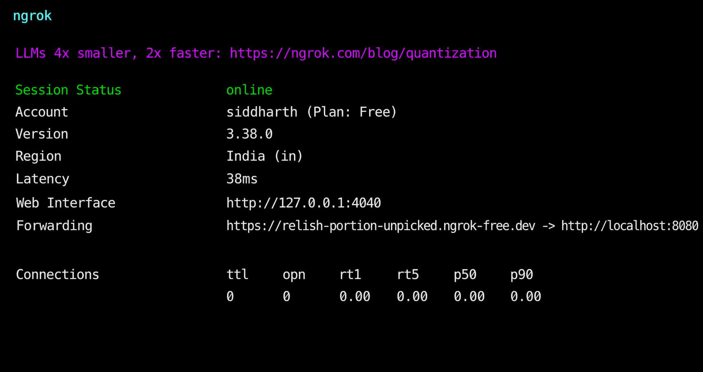

> ⚠️ The `/github-webhook/` path at the end is mandatory — Jenkins listens for GitHub events specifically at this endpoint.


**Step 4: Verify ngrok is receiving traffic**

In the ngrok terminal or the ngrok web dashboard (`http://127.0.0.1:4040`), check:

```
Connections > 0
HTTP 200 responses
```

A connection count above 0 confirms GitHub's requests are reaching your Jenkins instance.

> ⚠️ **Important:** The free tier of ngrok generates a new random URL every time you restart it. If ngrok is restarted, the GitHub webhook URL must be updated again with the new URL.

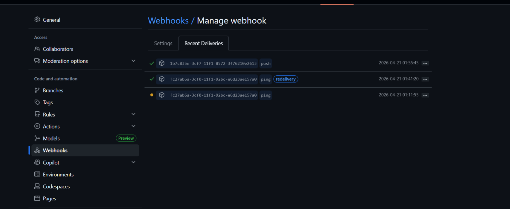
---

## Issue 3 — Jenkins 403 Forbidden (CSRF Protection)

Even after setting up ngrok and updating the webhook URL, webhook deliveries were still failing. The GitHub webhook response showed:

```
HTTP 403 Forbidden
```

And in Jenkins logs:

```
No valid crumb was included in the request
```

**Why this happens:**

Jenkins has a built-in security feature called **CSRF Protection** (Cross-Site Request Forgery Protection). CSRF is a type of web attack where a malicious website tricks a logged-in user's browser into making unauthorized requests to another site (in this case, Jenkins).

To prevent this, Jenkins requires all POST requests to include a special token called a **crumb** — a one-time security token that proves the request came from a legitimate source (like the Jenkins web UI). GitHub's webhook does not know about Jenkins' crumb system, so it sends a plain POST request without one. Jenkins sees a POST request without a crumb and rejects it with `403 Forbidden`.

```
GitHub webhook POST request
   │
   │  (no crumb token included)
   ▼
Jenkins CSRF Protection
   │
   │  "This request has no crumb — BLOCKED"
   ▼
403 Forbidden
```

### Fix — Disable CSRF Protection in Jenkins

Navigate to:
```
Manage Jenkins → Security → CSRF Protection
```

Either:
- **Disable** the "Prevent Cross Site Request Forgery exploits" option entirely, **OR**
- Install the **"GitHub plugin"** which handles CSRF exceptions for GitHub webhooks automatically

**To disable CSRF via the UI:**

1. Go to `Manage Jenkins → Configure Global Security`
2. Uncheck **"Prevent Cross Site Request Forgery exploits"**
3. Click **Save**

After this change, Jenkins accepts incoming POST requests from GitHub without requiring a crumb token.


> ⚠️ **Security note:** Disabling CSRF protection reduces security. This is acceptable for local learning environments. For production Jenkins, keep CSRF enabled and configure proper GitHub plugin settings instead.

---
## Issue 4 — Wrong Branch Name (master vs main)

Jenkins pipeline failed at the **Clone Source** stage with an error like:

```
ERROR: Couldn't find any revision to build. Verify the repository and target branch configuration for this pipeline.
```

Or Jenkins was trying to check out:

```
origin/master
```

But the GitHub repository used the default branch name:

```
main
```

**Why this happens:**

GitHub changed its default branch name from `master` to `main` in October 2020. Older Jenkins configurations, tutorials, and default settings still reference `master`. If the Jenkinsfile or job configuration specifies `master` but the repository only has a `main` branch, Git cannot find the branch and fails.

```
Jenkins requests:  git checkout master
GitHub repository: only has branch → main

Result: Branch not found → Build fails 
```

### Fix — Update the Branch Name in Jenkinsfile

Change the `git` step in the Jenkinsfile from:

```groovy

git branch: 'master', url: 'https://github.com/Pavilioni5/my-app.git'
```

To:

```groovy

git branch: 'main', url: 'https://github.com/Pavilioni5/my-app.git'
```

**Also verify in the Jenkins job configuration:**

Go to the pipeline job → **Configure** → **Branch Specifier** and set it to:
```
*/main
```

**How to check which branch your repository uses:**

```bash
git branch -a

```

---

## Issue 5 — Docker Not Found Inside Jenkins Container

The pipeline failed at the **Build Docker Image** stage with:

```
docker: not found
```

Or:

```
sh: docker: command not found
```

**Why this happens:**

The official `jenkins/jenkins:lts` Docker image does **not** include Docker pre-installed. When Jenkins tries to run `docker build` as a shell command, the shell inside the Jenkins container searches for a `docker` binary and cannot find one.

This happens when the `docker.sock` volume was not mounted (or the mount was not working), or when Docker CLI binaries are simply absent inside the container.

```
Jenkins Container
   └── sh 'docker build ...'
         └── searches for 'docker' binary in PATH
               └── not found → ERROR 
```

### Fix — Install Docker Inside the Jenkins Container

**Step 1: Enter the running Jenkins container**

```bash
docker exec -it jenkins bash
```

This opens a shell inside the Jenkins container as root.

**Step 2: Update the package list and install Docker**

```bash
apt-get update
apt-get install -y docker.io
```

`docker.io` is the Docker package available in Debian/Ubuntu repositories (which the Jenkins image is based on). This installs the Docker CLI and daemon binaries inside the container.

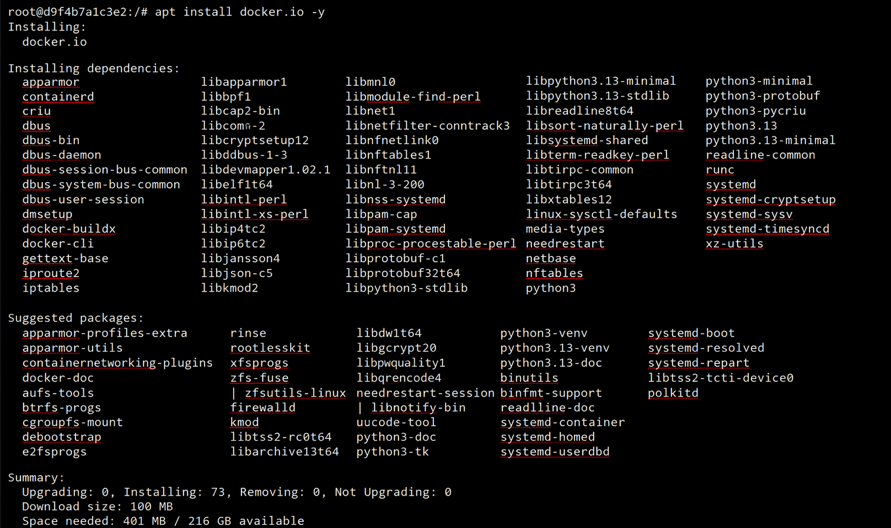

**Step 3: Verify Docker is now available**

```bash
docker --version
```

Expected output:
```
Docker version 20.x.x, build xxxxxxx
```

**Step 4: Exit the container**

```bash
exit
```

**Step 5: Restart the Jenkins container to apply changes**

```bash
docker restart jenkins
```

> ⚠️ **Important note:** Installing Docker inside the container this way is not persistent across full container recreations (if you `docker-compose down` and `up` again, you need to reinstall). The better long-term solution is to use the `docker.sock` mount properly (as configured in `docker-compose.yml`) so Jenkins uses the *host's* Docker CLI instead of needing its own.
