# Lab Experiment 9
## Ansible — Automated Server Configuration Management

## Aim
To understand and implement configuration management and automation using Ansible by setting up multiple servers and executing tasks through Ansible playbooks.

## Theory

### What is Ansible?

Ansible is an open-source IT automation tool developed by Red Hat. It is used for configuration management, application deployment, infrastructure provisioning, and task automation. Unlike many other automation tools, Ansible follows an **agentless architecture** — it communicates with managed nodes over **SSH** (for Linux/macOS) or **WinRM** (for Windows), requiring no additional software to be installed on the target machines.

Automation tasks in Ansible are described using **YAML-based playbooks**, which are human-readable files that define the desired state of a system. Ansible has become the industry standard for enterprise-grade automation due to its simplicity, extensibility, and vast module library.

### Key Concepts

| Component | Description |
|---|---|
| **Control Node** | The machine where Ansible is installed and from which automation is initiated. |
| **Managed Nodes** | Target servers or machines that Ansible configures. No Ansible agent is needed here. |
| **Inventory** | A file (e.g., `inventory.ini`) that lists all managed nodes grouped into categories. |
| **Playbooks** | YAML files containing an ordered sequence of automation steps (tasks). |
| **Tasks** | Individual actions within a playbook (e.g., install a package, copy a file). |
| **Modules** | Built-in functions that perform specific tasks (e.g., `apt`, `yum`, `copy`, `service`). |
| **Roles** | Predefined, reusable groups of tasks and configurations for modular playbooks. |

### How Ansible Works

Ansible connects from the **control node** to **managed nodes** using SSH. It transfers small pieces of code called **modules** to the managed nodes, executes them, and removes them once done. The sequence of tasks is defined in a **playbook**, and the list of target machines is maintained in an **inventory file**.

```
Control Node (Ansible Installed)
        |
        |--SSH--> Managed Node 1 (server1)
        |--SSH--> Managed Node 2 (server2)
        |--SSH--> Managed Node 3 (server3)
        |--SSH--> Managed Node 4 (server4)
```


### Why Use Ansible?

- **Scalability:** Easily manage hundreds of servers with the same playbook.
- **Consistency:** Ensures all servers have identical, predictable configurations.
- **Efficiency:** Eliminates repetitive manual tasks and reduces human error.
- **Infrastructure as Code (IaC):** Configuration is version-controlled, auditable, and reproducible.
- **Extensive Module Library:** 3000+ built-in modules for cloud (AWS/Azure), containers, networking, databases, and more.
- **Community & Documentation:** Massive open-source community with comprehensive official documentation.

### Ansible vs. Manual SSH Administration

| Feature | Manual SSH | Ansible |
|---|---|---|
| Scalability | Poor (one server at a time) | Excellent (all servers in parallel) |
| Consistency | Prone to drift | Guaranteed by playbooks |
| Repeatability | Manual re-execution | Idempotent by design |
| Documentation | None (implicit) | Playbook = living documentation |
| Speed | Slow for bulk tasks | Fast parallel execution |
| Error risk | High | Low |

---


## Part A — Installation and Basic Testing

### Step 1: Install Ansible

Ansible was first installed via `apt`:

```bash
sudo apt install ansible -y
```

**Output:**
```
ansible is already the newest version (2.10.7+merged+base+2.10.8+dfsg-1).
0 upgraded, 0 newly installed, 0 to remove and 54 not upgraded.
```

Version check:
```bash
ansible --version
```
```
ansible 2.9.27
  config file = None
  ansible python module location = /home/aniket/.local/lib/python3.10/site-packages/ansible
  executable location = /home/aniket/.local/bin/ansible
  python version = 3.10.12
```

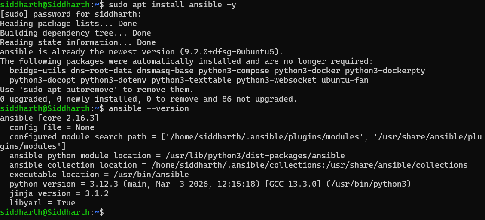

### Step 2: Post-Installation Ping Test

```bash
ansible localhost -m ping
```

**Output:**
```
[WARNING]: No inventory was parsed, only implicit localhost is available
localhost | SUCCESS => {
    "changed": false,
    "ping": "pong"
}
```

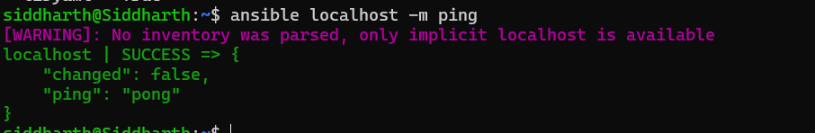

---

## Part A — Docker SSH Server Setup

### Step 3: Generate SSH Key Pair

```bash
ssh-keygen -t rsa -b 4096
```

**Output:**
```
Generating public/private rsa key pair.
Enter file in which to save the key (/home/aniket/.ssh/id_rsa): ssh
Your identification has been saved in ssh
Your public key has been saved in ssh.pub
The key fingerprint is:
SHA256:oZF3Tg319xGhvWUHku7U0iL9TWUeq8kxaFAswJN7O08 siddharth@Siddharth
```

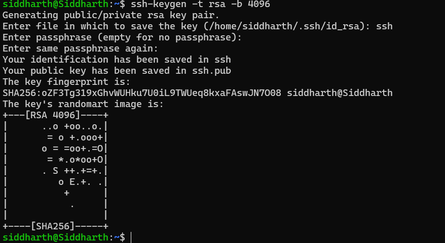

Keys were then copied to the working directory:
```bash
cp ~/.ssh/id_rsa.pub .
cp ~/.ssh/id_rsa .
```

**Key Placement Summary:**

| Key File | Location | Purpose |
|---|---|---|
| `id_rsa` (Private Key) | Control node (local machine) | Used to authenticate when connecting to servers. Never share! |
| `id_rsa.pub` (Public Key) | Managed node (`~/.ssh/authorized_keys`) | Grants access to anyone with the matching private key. |


### Step 4: Create the Dockerfile

A custom Ubuntu Docker image was created with OpenSSH server pre-configured:

```dockerfile
FROM ubuntu
RUN apt update -y
RUN apt install -y python3 python3-pip openssh-server
RUN mkdir -p /var/run/sshd

# Configure SSH
RUN mkdir -p /run/sshd && \
    echo 'root:password' | chpasswd && \
    sed -i 's/#PermitRootLogin prohibit-password/PermitRootLogin yes/' /etc/ssh/sshd_config && \
    sed -i 's/#PasswordAuthentication yes/PasswordAuthentication no/' /etc/ssh/sshd_config && \
    sed -i 's/#PubkeyAuthentication yes/PubkeyAuthentication yes/' /etc/ssh/sshd_config

# Create .ssh directory
RUN mkdir -p /root/.ssh && chmod 700 /root/.ssh

# Copy SSH keys
COPY id_rsa /root/.ssh/id_rsa
COPY id_rsa.pub /root/.ssh/authorized_keys

# Set key permissions
RUN chmod 600 /root/.ssh/id_rsa && \
    chmod 644 /root/.ssh/authorized_keys

# Fix for SSH login
RUN sed -i 's@session\s*required\s*pam_loginuid.so@session optional pam_loginuid.so@g' /etc/pam.d/sshd

EXPOSE 22
CMD ["/usr/sbin/sshd", "-D"]
```

### Step 5: Build the Docker Image

```bash
docker build -t ubuntu-server .
```

**Output (summarized):**
```
[+] Building 7.2s (16/16) FINISHED
 => [1/10] FROM docker.io/library/ubuntu:latest
 => [7/10] COPY id_rsa /root/.ssh/id_rsa
 => [8/10] COPY id_rsa.pub /root/.ssh/authorized_keys
 => [9/10] RUN chmod 600 /root/.ssh/id_rsa && chmod 644 /root/.ssh/authorized_keys
 => naming to docker.io/library/ubuntu-server:latest
```

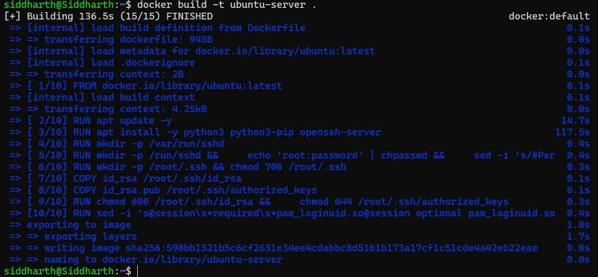

### Step 6: Test Single Container SSH

A test container was first run:
```bash
docker run -d --rm -p 2222:22 -p 8221:8221 --name ssh-test-server ubuntu-server
```

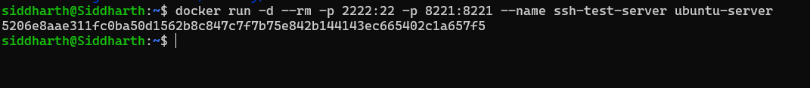
---

## Part B — Ansible with Multiple Docker Servers

### Step 7: Start 4 Server Containers

```bash
for i in {1..4}; do
  echo -e "\n Creating server${i}\n"
  docker run -d --rm -p 220${i}:22 --name server${i} ubuntu-server
  echo -e "IP of server${i} is $(docker inspect -f '{{range.NetworkSettings.Networks}}{{.IPAddress}}{{end}}' server${i})"
done
```

**Output:**
```
 Creating server1
c2c84a8d2f84d429207aca8d289f84222e234709f0309504d380a5aa83c59744
IP of server1 is 172.17.0.3

 Creating server2
35199a17a9ef6767265021e8c4ad73e290d3da8737781910eae3b855a0ff538c
IP of server2 is 172.17.0.4

 Creating server3
cd62395921ba1265ddda6a1fc12368c82446b56874a03c007188a74f279f2236
IP of server3 is 172.17.0.5

 Creating server4
27de68985fd101696537492a4194112f4bc57c04833066c575b1c8eb13189dc4
IP of server4 is 172.17.0.6
```

All 4 containers started successfully and were assigned IPs in the `172.17.0.x` range.

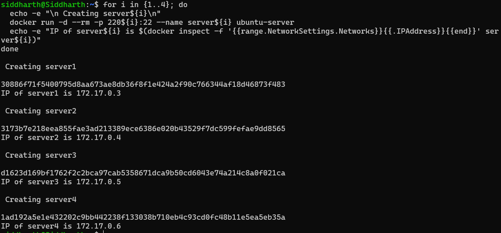

### Step 8: Create Ansible Inventory (`inventory.ini`)

```ini
[servers]
server1 ansible_host=localhost ansible_port=2201
server2 ansible_host=localhost ansible_port=2202
server3 ansible_host=localhost ansible_port=2203
server4 ansible_host=localhost ansible_port=2204

[servers:vars]
ansible_user=root
ansible_ssh_private_key_file=~/.ssh/id_rsa
ansible_python_interpreter=/usr/bin/python3
```
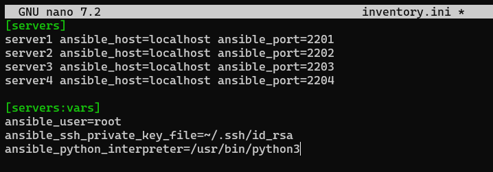

### Step 9: Troubleshooting — Ansible Version Mismatch

During the initial `ansible all -m ping` test, a module failure was observed:

```
ModuleNotFoundError: No module named 'ansible.module_utils.six.moves'
```

This was caused by a mismatch between the old Ansible 2.9.x installed via `apt` and the newer Python environment. The issue was resolved by reinstalling Ansible via `pip`:

```bash
pip uninstall ansible -y
pip install ansible
```

**New version installed:**
```
Successfully installed ansible-10.7.0 ansible-core-2.17.14
```
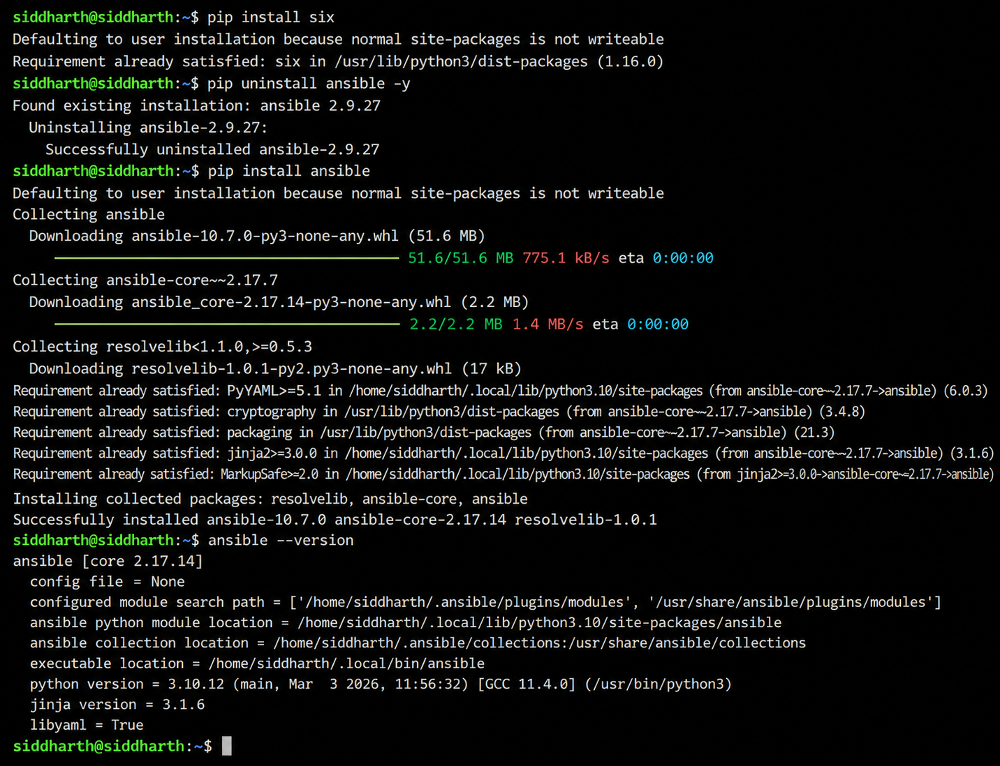

### Step 10: Test Ansible Connectivity (Ping All Servers)

SSH host key issues were resolved by clearing the known_hosts file, then the ping test was run:

```bash
ansible all -i inventory.ini -m ping
```

**Final Successful Output:**
```
server1 | SUCCESS => {
    "changed": false,
    "ping": "pong"
}
server4 | SUCCESS => {
    "changed": false,
    "ping": "pong"
}
server3 | SUCCESS => {
    "changed": false,
    "ping": "pong"
}
server2 | SUCCESS => {
    "changed": false,
    "ping": "pong"
}
```

All 4 servers responded successfully to the Ansible ping.

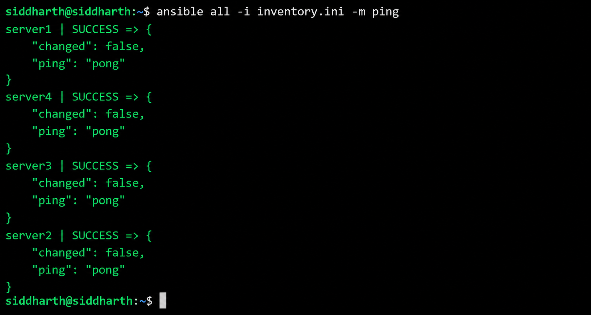

### Step 11: Create the Playbook (`playbook1.yml`)

```yaml
--- # Playbook must start with three dashes
- name: Update and configure servers
  hosts: all
  become: yes
  tasks:
    - name: Update apt packages
      apt:
        update_cache: yes
        upgrade: dist

    - name: Install required packages
      apt:
        name: ["vim", "htop", "wget"]
        state: present

    - name: Create test file
      copy:
        dest: /root/ansible_test.txt
        content: "Configured by Ansible on {{ inventory_hostname }}"
```

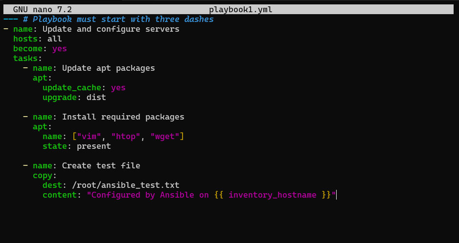

### Step 12: Run the Playbook

```bash
ansible-playbook -i inventory.ini playbook1.yml
```

**Output:**
```
PLAY [Update and configure servers] *******************************************************

TASK [Gathering Facts]
ok: [server1]
ok: [server2]
ok: [server3]
ok: [server4]

TASK [Update apt packages]
changed: [server1]
changed: [server2]
changed: [server3]
changed: [server4]

TASK [Install required packages]
changed: [server1]
changed: [server2]
changed: [server3]
changed: [server4]

TASK [Create test file]
changed: [server1]
changed: [server2]
changed: [server3]
changed: [server4]

PLAY RECAP ********************************************************************************
server1  : ok=4  changed=3  unreachable=0  failed=0  skipped=0
server2  : ok=4  changed=3  unreachable=0  failed=0  skipped=0
server3  : ok=4  changed=3  unreachable=0  failed=0  skipped=0
server4  : ok=4  changed=3  unreachable=0  failed=0  skipped=0
```

All 4 tasks executed successfully on all 4 servers with 3 changes each.

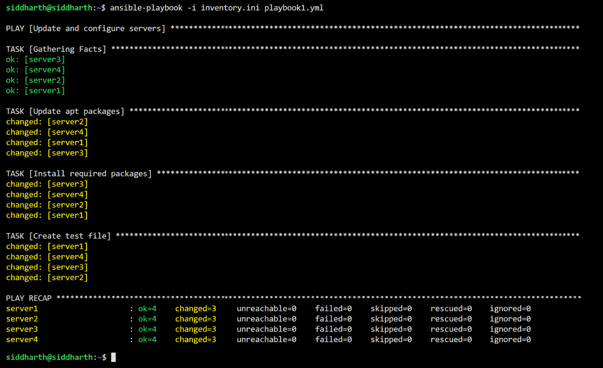

### Step 13: Verify Changes

**Using Ansible:**
```bash
ansible all -i inventory.ini -m command -a "cat /root/ansible_test.txt"
```

**Output:**
```
server3 | CHANGED | rc=0 >>
Configured by Ansible on server3
server1 | CHANGED | rc=0 >>
Configured by Ansible on server1
server4 | CHANGED | rc=0 >>
Configured by Ansible on server4
server2 | CHANGED | rc=0 >>
Configured by Ansible on server2
```

**Using Docker exec directly:**
```bash
for i in {1..4}; do
  docker exec server${i} cat /root/ansible_test.txt
done
```

Both methods confirmed that the test file was correctly created on each server with the respective hostname.

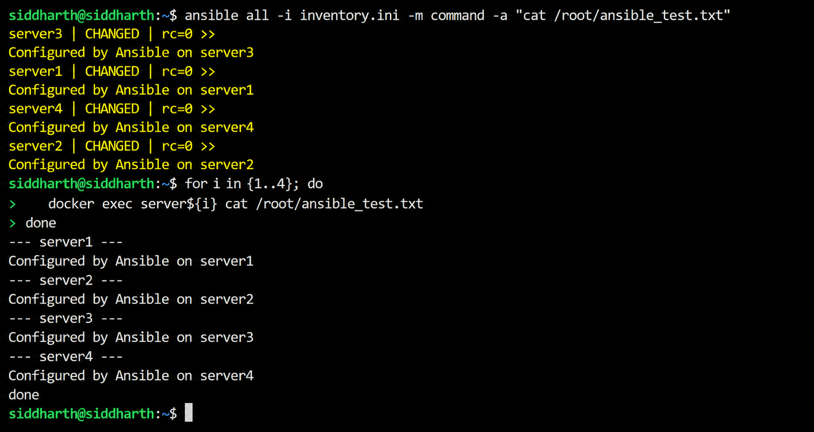
---

## Workflow Summary

```
1. Generate SSH Key Pair
        ↓
2. Build ubuntu-server Docker Image (with OpenSSH + SSH keys)
        ↓
3. Launch 4 Docker Containers (server1–server4)
        ↓
4. Create Ansible Inventory (inventory.ini)
        ↓
5. Test Connectivity (ansible -m ping)
        ↓
6. Write Playbook (playbook1.yml)
        ↓
7. Run Playbook (ansible-playbook)
        ↓
8. Verify Changes
        ↓
9. Cleanup (docker rm -f)
```

---


## Observations and Results

- Ansible successfully managed all 4 Docker-based server nodes from a single control node.
- The `ping` module confirmed SSH-based connectivity without passwords, using key-pair authentication.
- The playbook updated packages, installed `vim`, `htop`, and `wget`, and created a unique test file on each server — all in a single run.
- The **PLAY RECAP** showed `ok=4, changed=3, failed=0` for every server, indicating clean, error-free execution.
- Verification via both `ansible -m command` and `docker exec` confirmed identical, consistent results across all nodes.

---

