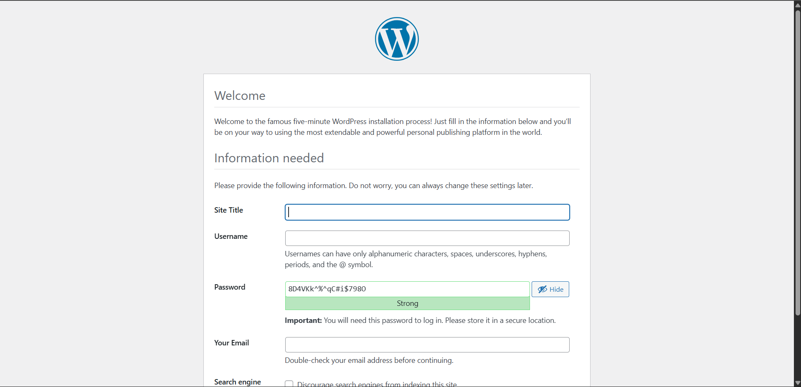

## Docker Compose
**1. Theory: Docker Compose vs Docker Run**

Docker Compose is a tool for defining and managing multi-container
Docker applications. It uses a YAML configuration file
(docker-compose.yml) to describe all the services, networks, and volumes
your application needs, and then creates and starts them all with a
single command.

**What is Docker Run?**

docker run is an imperative command used to launch a single Docker
container. Every configuration option (ports, volumes, environment
variables, network, etc.) must be passed as flags on the command line
each time you run the container. This approach is verbose and
error-prone for complex setups.

```
Example: Running Nginx with docker run
docker run -d \
  --name my-nginx \
  -p 8080:80 \
  -v ./html:/usr/share/nginx/html \
  -e NGINX_HOST=localhost \
  --restart unless-stopped \
  nginx:alpine
```
**What is Docker Compose?**

Docker Compose is a declarative approach --- you define WHAT you want,
not HOW to do it. All the same configuration that you would pass to
docker run is written once in a YAML file and can be reused,
version-controlled, and shared with team members.
```
# docker-compose.yml
version: 3.8

services:
  nginx:
    image: nginx:alpine
    container_name: my-nginx
    ports:
      - "8080:80"
    volumes:
      - ./html:/usr/share/nginx/html
    environment:
      - NGINX_HOST=localhost
    restart: unless-stopped
```
**Key Advantages of Docker Compose**

-   Simplicity: One command (docker compose up -d) starts the entire
    multi-container application.

-   Reproducibility: Same configuration runs identically on every
    machine --- no forgotten flags.

-   Declarative: Define what you want, not how to run it.
    Self-documenting configuration.

-   Lifecycle Management: Easy commands to start, stop, view logs, and
    check status.

-   Dependency Management: Use depends_on to control startup order
    between services.

-   Scalability: Scale individual services with \--scale flag.

**Flag Mapping: docker run → docker-compose.yml**

This guide provides a quick mapping between `docker run` command-line flags and their equivalent syntax in a `docker-compose.yml` file.

| docker run Flag | Docker Compose Equivalent | Description |
| :--- | :--- | :--- |
| `-p 8080:80` | `ports: ["8080:80"]` | Map host port to container port. |
| `-v ./data:/app` | `volumes: ["./data:/app"]` | Bind mount a host directory or volume. |
| `-e KEY=value` | `environment: ["KEY=value"]` | Set environment variables. |
| `--name myapp` | `container_name: myapp` | Assign a specific name to the container. |
| `--network net` | `networks: ["net"]` | Connect the service to a specific network. |
| `--restart always` | `restart: always` | Set the restart policy. |
| `-d` | `docker compose up -d` | **CLI Flag:** Run in detached mode. |
| `--link db` | `links: ["db"]` | (Legacy) Explicitly link to another container. |
| `N/A` | `depends_on: ["db"]` | Startup order (wait for `db` to start first). |
| `-w /app` | `working_dir: /app` | Set the working directory inside the container. |
| `--user 1000` | `user: "1000"` | Run as a specific user (UID). |

---

**2. Practical: WordPress + MySQL with Docker Compose**

**The docker-compose.yml File**

The following compose file defines two services (wordpress and mysql), a
shared network, and persistent volumes for both containers:
```
# docker-compose.yml
version: '3.8'

services:
  mysql:
    image: mysql:5.7
    container_name: mysql
    environment:
      MYSQL_ROOT_PASSWORD: secret
      MYSQL_DATABASE: wordpress
      MYSQL_USER: wpuser
      MYSQL_PASSWORD: wppass
    volumes:
      - mysql_data:/var/lib/mysql
    networks:
      - wordpress-network

  wordpress:
    image: wordpress:latest
    container_name: wordpress
    ports:
      - "8080:80"
    environment:
      WORDPRESS_DB_HOST: mysql
      WORDPRESS_DB_USER: wpuser
      WORDPRESS_DB_PASSWORD: wppass
      WORDPRESS_DB_NAME: wordpress
    volumes:
      - wp_content:/var/www/html/wp-content
    depends_on:
      - mysql
    networks:
      - wordpress-network

volumes:
  mysql_data:
  wp_content:

networks:
  wordpress-network:

```
**Create the Compose File**

```nano docker-compose.yml```

  **Command:** nano is a terminal-based text editor. This command
  creates/opens the file docker-compose.yml for editing. Press Ctrl+X,
  then Y, then Enter to save and exit.

---
**Start the Containers**

```docker compose up -d```

  **Command:** docker compose up -d --- Builds, (re)creates, starts, and
  attaches to containers defined in the compose file. The -d flag runs
  them in detached (background) mode, so your terminal is not blocked.

Expected output:
```
✔ Network devops_wordpress-network Created 0.1s
✔ Container mysql Created 0.2s
✔ Container wordpress Created 0.1s
```
---
**Port Conflict --- Error and Fix**

On the first attempt, an error occurred because port 8080 was already in
use by another process on the host:

> Error response from daemon: failed to set up container networking:
>
> failed to bind host port 0.0.0.0:8080/tcp: address already in use


  **Explanation:** Each port on a host machine can only be bound to one
  process at a time. Port 8080 was occupied by another container or
  service. The solution was to edit docker-compose.yml to change the host
  port (e.g., 8081:80) or stop the conflicting process.


To resolve, the containers were brought down, the compose file was
edited to use a free port, then started again:

> docker compose down
>
> \# (edit docker-compose.yml to change port mapping)
>
> docker compose up -d

  **Command:** docker compose down --- Stops and removes containers,
  networks, and the default network created by \'up\'. Volumes are
  preserved unless \--volumes flag is passed.

  -----------------------------------------------------------------------
**Check the webside**

```
http://localhost:9090
```



If WordPress is working, that means:
- MySQL container is running
- WordPress container is running
- Network is working
- Volumes are mounted correctly

---

**Attempt Service Scaling**

```
docker compose up \--scale wordpress=3 -d
```

  **Command:** docker compose up \--scale \<service\>=\<count\> -d ---
  Attempts to run the specified number of replicas of a service. This is
  useful for load testing or high availability setups.

  -----------------------------------------------------------------------

However, this produced a warning:

```
docker compose up --scale wordpress=3 -d
WARN[0000] /mnt/d/ccvt/sem 6/devops/docker-compose.yml: the attribute `version` is obsolete, it will be ignored, please remove it to avoid potential confusion
[+] up 1/1
 ✔ Container mysql Running                                              0.0s
WARNING: The "wordpress" service is using the custom container name "wordpress". Docker requires each container to have a unique name. Remove the custom name to scale the service
```

  **Explanation:** The container_name: wordpress field in the compose
  file forces all replicas to use the same name. Since Docker container
  names must be unique, scaling fails. To enable scaling, remove the
  container_name field so Docker auto-generates unique names like
  devops_wordpress_1, devops_wordpress_2, etc.

  -----------------------------------------------------------------------

**Tear Down**

```
docker compose down
```

This cleanly removes all containers and networks created during the
session. Final output:
```
✔ Container wordpress Removed 1.5s
✔ Container mysql Removed 1.8s
✔ Network devops_wordpress-network Removed 0.3s
```
---
**3. Quick Reference Cheatsheet: Docker Compose CLI**

This cheatsheet covers the most frequently used commands for managing multi-container applications.

| **Command** | **Description** |
| :--- | :--- |
| `docker compose up -d` | Start all services in the background (**detached mode**). |
| `docker compose down` | Stop and **remove** containers, networks, and images defined in the file. |
| `docker compose logs -f` | View real-time log output from all services (`-f` to follow). |
| `docker compose ps` | List the status of containers managed by the current project. |
| `docker compose up -d --scale svc=3` | Scale a specific service (`svc`) to 3 running replicas. |
| `docker compose restart` | Restart all containers in the project. |
| `docker compose exec <svc> bash` | Open an interactive **bash shell** inside a running service container. |
| `docker compose pull` | Download the latest versions of the images defined in your YAML. |
| `docker compose build` | Rebuild images defined with a `build:` context in the YAML. |
| `docker compose stop` | Stop services without removing the containers or networks. |

---
### WSL Command 
```
aniket@Aniket:/mnt/d/ccvt/sem 6/devops$ nano docker-compose.yml
aniket@Aniket:/mnt/d/ccvt/sem 6/devops$ docker compose up -d
WARN[0000] /mnt/d/ccvt/sem 6/devops/docker-compose.yml: the attribute `version` is obsolete, it will be ignored, please remove it to avoid potential confusion
[+] up 3/3
 ✔ Network devops_wordpress-network Created                             0.1s
 ✔ Container mysql                  Created                             0.2s
 ✔ Container wordpress              Created                             0.1s
Error response from daemon: failed to set up container networking: driver failed programming external connectivity on endpoint wordpress (426628fa36705fa2a82e5b8ec5b3cc75293e1500dd2d2ccc1caa2d259ff2a041): failed to bind host port 0.0.0.0:8080/tcp: address already in use
aniket@Aniket:/mnt/d/ccvt/sem 6/devops$ nano docker-compose.yml
aniket@Aniket:/mnt/d/ccvt/sem 6/devops$ docker compose down
WARN[0000] /mnt/d/ccvt/sem 6/devops/docker-compose.yml: the attribute `version` is obsolete, it will be ignored, please remove it to avoid potential confusion
[+] down 3/3
 ✔ Container wordpress              Removed                             0.1s
 ✔ Container mysql                  Removed                             2.2s
 ✔ Network devops_wordpress-network Removed                             0.3s
aniket@Aniket:/mnt/d/ccvt/sem 6/devops$ docker compose up -d
WARN[0000] /mnt/d/ccvt/sem 6/devops/docker-compose.yml: the attribute `version` is obsolete, it will be ignored, please remove it to avoid potential confusion
[+] up 3/3
 ✔ Network devops_wordpress-network Created                             0.0s
 ✔ Container mysql                  Created                             0.1s
 ✔ Container wordpress              Created                             0.1s
aniket@Aniket:/mnt/d/ccvt/sem 6/devops$ docker compose up --scale wordpress=3 -d
WARN[0000] /mnt/d/ccvt/sem 6/devops/docker-compose.yml: the attribute `version` is obsolete, it will be ignored, please remove it to avoid potential confusion
[+] up 1/1
 ✔ Container mysql Running                                              0.0s
WARNING: The "wordpress" service is using the custom container name "wordpress". Docker requires each container to have a unique name. Remove the custom name to scale the service
aniket@Aniket:/mnt/d/ccvt/sem 6/devops$ docker compose down
WARN[0000] /mnt/d/ccvt/sem 6/devops/docker-compose.yml: the attribute `version` is obsolete, it will be ignored, please remove it to avoid potential confusion
[+] down 3/3
 ✔ Container wordpress              Removed                             1.5s
 ✔ Container mysql                  Removed                             1.8s
 ✔ Network devops_wordpress-network Removed                             0.3s
aniket@Aniket:/mnt/d/ccvt/sem 6/devops$
```