# Hands-on Task: Run and Manage a “Hello Web App” (httpd)

## Objective

Deploy and manage a simple Apache-based web server and:

* verify it is running
* modify it
* scale it
* debug it

> Submit it on GitHub Repo under Theory or Class folder and share its URL

---

# Task: Deploy a Simple Web Application (Apache httpd)

You will run an Apache server instead of nginx.


## Step 1: Run a Pod

```bash
kubectl run apache-pod --image=httpd
```


Check:

```bash
kubectl get pods
```
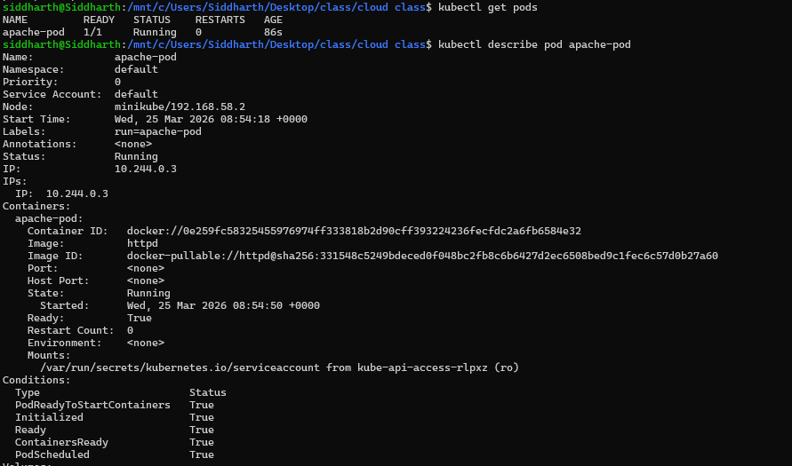


## Step 2: Inspect Pod

```bash
kubectl describe pod apache-pod
```

Focus:

* container image = `httpd`
* ports (default 80)
* events


## Step 3: Access the App

```bash
kubectl port-forward pod/apache-pod 8081:80
```


Open:

```
http://localhost:8081
```
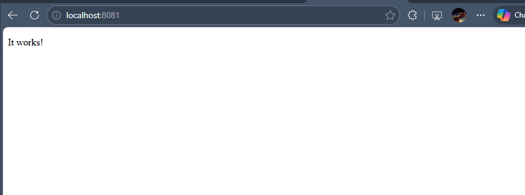

You should see:
→ Apache default page (“It works!”)


## Step 4: Delete Pod

```bash
kubectl delete pod apache-pod
```

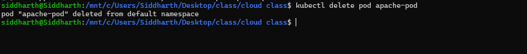

---

### Insight

Same as before:

* Pod disappears permanently
* No self-healing


# Task: Convert to Deployment


## Step 5: Create Deployment

```bash
kubectl create deployment apache --image=httpd
```

Check:

```bash
kubectl get deployments
kubectl get pods
```

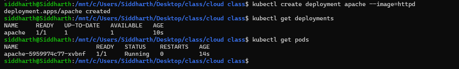


## Step 6: Expose Deployment

```bash
kubectl expose deployment apache --port=80 --type=NodePort
```

Access again:

```bash
kubectl port-forward service/apache 8082:80
```

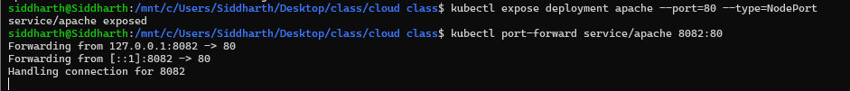

Open:

```
http://localhost:8082
```

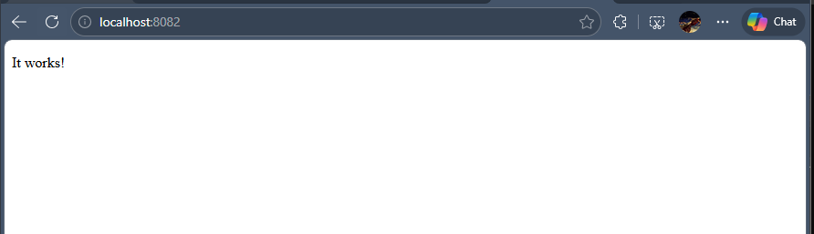

---

# Task: Modify Behavior


## Step 7: Scale Deployment

```bash
kubectl scale deployment apache --replicas=2
```

Check:

```bash
kubectl get pods
```

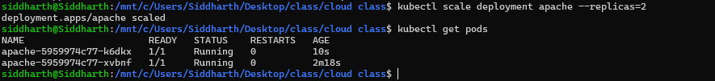


### Observe

* Multiple pods running same app


## Step 8: Test Load Distribution (Basic)

Run port-forward again and refresh browser multiple times.

(Advanced later: logs + different content per pod)

---

# Task: Debugging Scenario


## Step 9: Break the App

```bash
kubectl set image deployment/apache httpd=wrongimage
```

Check:

```bash
kubectl get pods
```

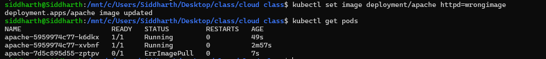


## Step 10: Diagnose

```bash
kubectl describe pod <pod-name>
```

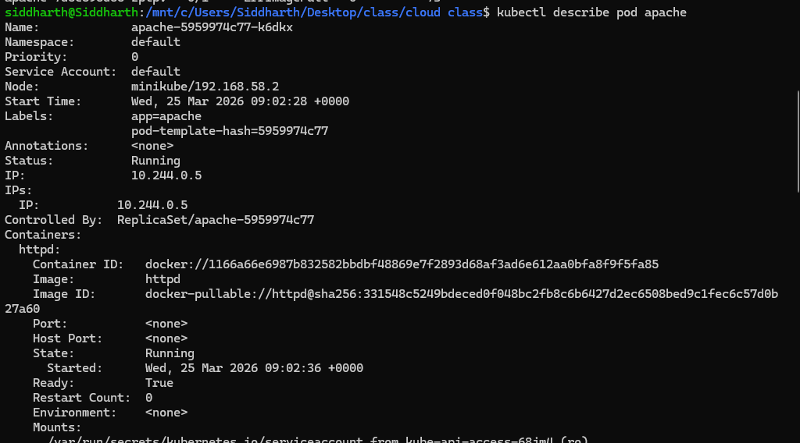

Look for:

* `ImagePullBackOff`
* error messages


## Step 11: Fix It

```bash
kubectl set image deployment/apache httpd=httpd
```

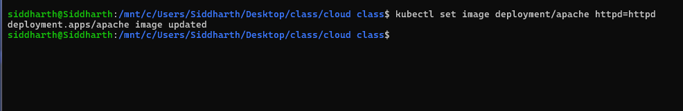

---

# Task: Explore Inside Container (Important Skill)


## Step 12: Exec into Pod

```bash
kubectl exec -it <pod-name> -- /bin/bash
```

Now inside container:

```bash
ls /usr/local/apache2/htdocs
```

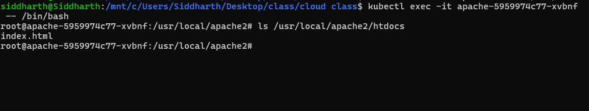

This is where web files are stored.

Exit:

```bash
exit
```


---
# Task: Observe Self-Healing


## Step 13: Delete One Pod

```bash
kubectl delete pod <one-pod-name>
```

Watch:

```bash
kubectl get pods -w
```

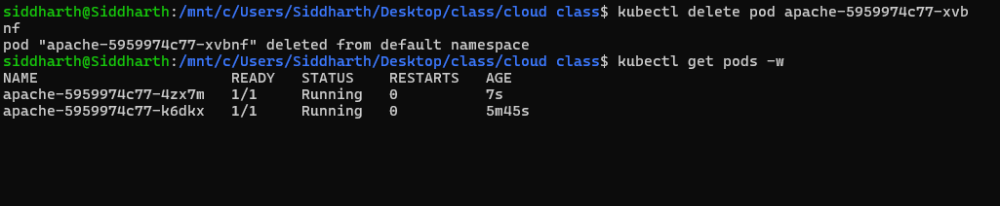


### Insight

* Deployment recreates pod automatically


# Task: Cleanup

```bash
kubectl delete deployment apache
kubectl delete service apache
```

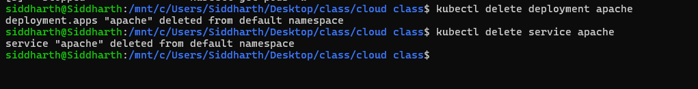


# What You Learned (Important)

This task is better than nginx because:

* You accessed actual web output
* You explored container filesystem
* You practiced debugging real errors
* You saw scaling + recovery


---
